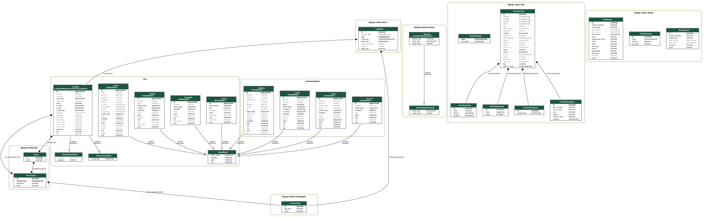
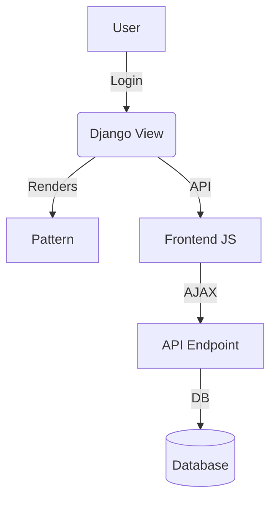

# Project Map: webClerk3

## Directory Structure

webClerk3/
├── core/
│   ├── models.py
│   ├── views/
│   ├── services/
│   ├── templates/
│   └── ...
├── communications/
│   ├── models.py
│   └── ...
├── templates/
│   ├── base.html
│   ├── signin.html
│   ├── signup.html
│   ├── manager.html
│   └── ...
├── common/
│   ├── default_access.json
│   └── ...
└── webclerk3_api/
    ├── settings.py
    └── ...
```

---

## API Endpoints

| Endpoint                                 | View/Class         | Pattern           | Purpose                        |
|-------------------------------------------|--------------------|--------------------|--------------------------------|
| `/wcapi/manage/?table_name=contacts`      | ManageView         | manager.html       | List/manage contacts           |
| `/wcapi/get/?table_name=contacts&id=123`  | GetView            | N/A (JSON)         | Get contact details (API)      |
| `/signin/`                               | WebLoginView       | signin.html        | User login                     |
| `/signup/`                               | WebSignupView      | signup.html        | User registration              |

---

## Data Model Diagram



---

## Component Diagram (Mermaid Example)



---

## Key Files and Their Purpose

- `core/views/related_view.py`: Handles related data API for contacts and other tables.
- `core/services/view_edit_access.py`: Manages role-based field access logic.
- `templates/manager.html`: Main management UI for contacts and related data.
- `common/default_access.json`: Stores access control rules for roles and tables.

---

## Extensions & Infrastructure

### Celery (Task Queue)

- **Purpose:** Handles background tasks (e.g., sending emails, processing data) outside the main Django request/response cycle.
- **Startup Behavior:**  
  - On worker startup, Celery imports `core/services/view_edit_access.py`.
  - This triggers loading of `role_access` (access rules) into memory for **each worker process**.
  - If you update access rules, you must reload or restart workers to refresh their in-memory data.
- **Key Files:**
  - `celery_app.py` (Celery app configuration)
  - `core/services/view_edit_access.py` (loads access rules at import)
  - `core/tasks.py` (Celery tasks)

- **Purpose:** Provides containerized, reproducible environments for development, testing, and deployment.
- **Key Files:**

- **Usage:**
  - Build and run all services with:  

  - Services typically include:  
    - `web`: Django app
    - `celery`: Celery worker
    - `redis`: Message broker for Celery
    - `db`: Postgres database

---

## Startup Sequence (Celery Example)

1. **Django or Celery worker starts.**
2. **`core/services/view_edit_access.py` is imported.**
3. **Access rules (`role_access` data) are loaded into memory.**
4. **Each Celery worker has its own copy of the access rules.**
5. **If access rules change, workers must be restarted or reloaded.**

---

## Other Extensions

- **Redis:** Used as the message broker for Celery.
- **Postgres:** Main database for Django.
- **(Add others as needed, e.g., Sentry for error tracking, etc.)**

---

*Expand this map as your project evolves!*