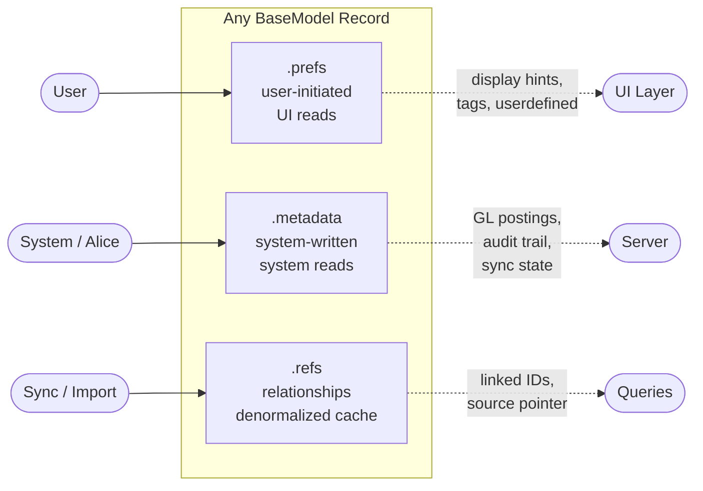
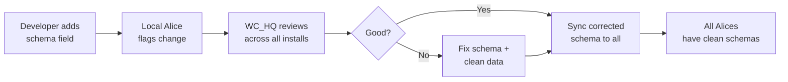

# JSON Envelope Policy — .prefs, .metadata, .refs on Every Record

## The Three Envelopes

Every BaseModel record has three JSON fields. Each has one job.



## .prefs — The User's Space

**Who writes:** The user, through the UI.
**Who reads:** The UI layer, to customize display and behavior.
**What goes here:**

```json
{
  "userdefined": {
    "project_code": "PROJ-2026-A",
    "rush": true
  },
  "tags": ["vip", "recurring"],
  "pinned": true,
  "notes_private": "Bill prefers email over phone"
}
```

**Rules:**
- Only user-initiated data. Never system-generated.
- UI reads `.prefs.userdefined` to render custom fields.
- `.prefs.tags` are personal — not categories (categories are model fields).
- Never put display layout here — that's in the Setting workbench_fields.
- Never put defaults here — that's in the Setting field_access `.prefs.defaults`.

## .metadata — The System's Space

**Who writes:** Server code, Alice, automation, sync.
**Who reads:** Server code, Alice, reconciliation, audit.
**What goes here:**

```json
{
  "gl_accounts": {
    "event": "payment_journalized",
    "posted": true,
    "dt_posted": 1722384000000
  },
  "ledger": {
    "entries": [{"ledger_id": 42, "value_original": 500.0}],
    "dt_sync": 1722384000000
  },
  "reconciliation": {
    "batch_id": "REC-2026-07",
    "statement_date": "2026-07-31",
    "notes": ""
  },
  "import": {
    "source": "mac_contacts",
    "dt_imported": 1722384000000,
    "risk": "low",
    "original": { "raw_name": "VESSCO INC" }
  },
  "audit_trail": [
    {"action": "payment_applied", "dt": 1722384000000, "details": {}}
  ],
  "gateway_metadata": {}
}
```

**Rules:**
- Only system-generated data. Never user-typed.
- Audit trail entries are append-only. Never delete.
- GL postings, sync state, import provenance — all here.
- Never put user preferences here. That's `.prefs`.
- Never put relationship pointers here. That's `.refs`.

## .refs — The Relationship Cache

**Who writes:** Server code on save, sync on import.
**Who reads:** Queries that need to find related records without JOINs.
**What goes here:**

```json
{
  "links": {
    "customer_id": 1234,
    "vendor_id": 5678,
    "contact_id": 42,
    "invoice_ids": [100, 101],
    "order_ids": [200]
  },
  "source": {
    "type": "invoice",
    "id": 100
  },
  "import": {
    "risk": "medium",
    "match_score": 0.85,
    "contact": [{"id": 42, "score": 0.9}]
  }
}
```

**Rules:**
- **Secondary to PKs/FKs.** The FK is authoritative. `.refs.links` is a denormalized cache for fast queries.
- Never read `.refs` to determine a relationship. Read the FK.
- `.refs` is rebuilt on sync. It can be stale. PKs are never stale.
- `.refs.source` points to the originating document (invoice → payment, order → invoice).
- `.refs.import` holds match candidates from data imports. Cleared after user review.

## Decision Table

| I need to store... | Put it in | Example |
|--------------------|-----------|---------|
| A custom field the user added | `.prefs.userdefined` | project_code, rush flag |
| User's personal tags | `.prefs.tags` | vip, recurring |
| GL posting status | `.metadata.gl_accounts` | posted, dt_posted |
| Import provenance | `.metadata.import` | source, original values |
| Audit trail entry | `.metadata.audit_trail` | payment_applied, timestamp |
| Reconciliation state | `.metadata.reconciliation` | batch_id, statement_date |
| Gateway response | `.metadata.gateway_metadata` | Stripe response JSON |
| Linked record IDs | `.refs.links` | customer_id, invoice_ids |
| Source document pointer | `.refs.source` | {type: 'invoice', id: 100} |
| Import match candidates | `.refs.import` | scored contact matches |
| Installation defaults | `Setting.prefs.defaults` | NOT on the record |
| Field display config | `Setting.config` | NOT on the record |

## The Principle

The user owns `.prefs`. The system owns `.metadata`. Relationships live in `.refs`.
If you're not sure which envelope, ask: "Who writes this — the user or the system?"
If the user writes it, `.prefs`. If the system writes it, `.metadata`. If it's a
pointer to another record, `.refs`.

Never cross the streams. A user preference in `.metadata` is invisible to the UI.
A system audit entry in `.prefs` clutters the user's space. A relationship in
`.metadata` is unfindable by queries.

## Pydantic Schema Mandate

Every JSON envelope gets a Pydantic schema. No untyped dicts.

**Location:** `common/schemas/{model}.py`
**Template:** `common/schemas/_template.py`
**Base types:** `common/schemas/envelopes.py`

```python
from common.schemas.payment import PaymentMetadata, PaymentPrefs, PaymentRefs

# Validate existing data
meta = PaymentMetadata(**record.metadata)

# Build from scratch
meta = PaymentMetadata(gl_accounts=GlStage(event='payment_journalized', posted=True))
record.metadata = meta.model_dump()
```

**Rules:**
1. Every model gets a schema file. Copy `_template.py`, fill in the fields.
2. New JSON keys require a schema update first. Schema is the contract.
3. `extra = 'forbid'` on production schemas — unknown keys are errors, not features.
4. `extra = 'allow'` on `userdefined` and `SettingDefaults` — these are intentionally open.

## Alice Schema Review Cycle

Schemas evolve. Every installation's Alice watches for changes. Bad patterns
get caught before they spread.



**The cycle:**
1. Developer adds or changes a field in a schema → commits
2. Local Alice detects the schema diff → reports to WC_HQ via sync
3. WC_HQ reviews the change across all installations — is this a good pattern?
4. If good: approved, synced to all installations
5. If bad: corrected, data cleaned, corrected schema synced back
6. Before the whole world is addicted to a bad idea, the datasets are clean

**Why this matters:** One installation puts `payment.metadata.customer_phone`
(wrong envelope — that's a contact field). If unchecked, 50 installations copy
the pattern. Alice catches it at step 2. WC_HQ corrects at step 3. The 49
other installations never see the bad pattern.

## What About .comments and .actions?

Two additional JSON envelopes exist on BaseModel:

| Field | Purpose |
|-------|---------|
| `.comments` | Structured comments/notes attached to the record |
| `.actions` | Actionable flags and next-step metadata |

These are straightforward — comments are comments, actions are action items.
They don't overlap with prefs/metadata/refs.
