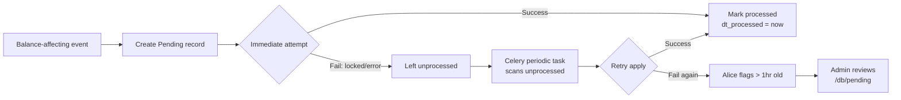

# Pending Architecture

**Established:** 2026-07-25
**Status:** Active — inventory, ledger sync, payment application all wired

---

## Model & Concept

The `Pending` model (`apps/core/models/pending.py`) is a **general-purpose compensating
transaction mechanism** for eventual consistency. When immediate consistency is blocked
— by record contention, concurrent edits, locked rows, or transient failures — a Pending
record captures the intended operation as a command object that Celery retries until the
system converges.

### Fields

| Field | Type | Purpose |
|-------|------|---------|
| `model_name` | CharField | What type of record this affects |
| `record_id` | CharField | The specific record PK |
| `purpose` | CharField | Machine-readable intent (e.g., `inventory_line_add`, `ledger_sync`) |
| `name` | CharField | Human-readable description |
| `data` | JSONField | Everything the processor needs to act |
| `dt_created` | BigIntegerField | When created (epoch ms) |
| `dt_processed` | BigIntegerField | 0 = unprocessed, >0 = epoch ms when completed |

### The Key Insight

In the happy path, the Pending record is created AND processed in the same request
cycle. It still exists as an audit trail. Only on failure does it become a retry command.

### Lifecycle

```
Event occurs (invoice save, line add, etc.)
    |
    +-- Create Pending record (purpose + data)
    |
    +-- Attempt immediate execution (happy path)
    |       |
    |       +-- Success -> mark Pending processed (dt_processed = now)
    |       |
    |       +-- Failure -> Pending stays unprocessed (dt_processed = 0)
    |                       |
    |                       +-- Celery picks up -> retries -> marks processed
    |
    +-- Pending persists as audit record regardless of path
```

---

## Business Flows

Pending records paint a picture of flows. Users keep them for a long time because they
show the history of how money and inventory moved through the business. They are not
temporary queue items — they are the narrative of the business.

### Three Parallel Flows

| Flow | Model | What it stages |
|------|-------|---------------|
| **Money in** | Ledger | Invoice posted, payment applied, discount taken (AR) |
| **Money out** | Ledger | Purchase committed, payment made, credit received (AP) |
| **Inventory** | Inventory Pending | Goods received/shipped/transferred/reserved |
| **Cash application** | Payment Pending | Cash allocated across invoices |

### AR vs AP on Ledger

No separate `ledger_type` field. The `model_name` discriminates:
- `invoice` = AR (customer owes you)
- `purchase` = AP (you owe vendor)
- `adjustment` = either (source field says 'ar' or 'ap')

### The Rule

> **Never a record lock without a dangling pending.**

If a record is locked, there MUST be a pending record explaining why, who locked it,
what it's waiting for, and what happens if it times out.

### AR Flow

```
Customer places order
    +-- Inventory Pending: reserve on_so for each line item
Order ships
    +-- Inventory Pending: move on_so -> on_hand -> shipped
    +-- Order -> Invoice (conversion pending)
Invoice posted
    +-- Ledger records created from payment terms
    +-- Ledger Sync Pending: update org balance
Customer pays (partial)
    +-- Payment Pending: allocate $500 of $1000 to Invoice #42
    +-- Ledger.value_available reduced by $500
Customer pays (remainder)
    +-- Payment Pending: allocate $500 to Invoice #42
    +-- Ledger.value_available = 0, is_settled = true
    +-- Invoice status -> paid
    +-- All pending records stay as the complete flow picture
```

### AP Flow

```
PO sent to vendor
    +-- Inventory Pending: reserve on_po for each line item
Goods received
    +-- Inventory Pending: move on_po -> on_hand
    +-- Receiving Report (GRN) created
Vendor invoice arrives
    +-- Ledger records created from vendor terms
Payment to vendor
    +-- Payment Pending: allocate payment to vendor invoice
    +-- Flow picture complete
```

---

## Active Implementations

### Inventory Pending (Established)

Line operations create Pending records instead of updating Item directly.
A background processor aggregates and applies deltas.

| Purpose | Trigger |
|---------|---------|
| `inventory_line_add` | New line on order/invoice/etc. |
| `inventory_qty_change` | Quantity edited on existing line |
| `inventory_line_delete` | Line removed from transaction |
| `inventory_cost_change` | Cost updated on line |

**Files:** `line_item_service.py` (creation), `pending_inventory_processor.py` (processing),
`dispatch_pending.py` (dispatch), `products/tasks.py` (Celery).

### Ledger Sync

Every invoice save that touches ledgers creates a `ledger_sync` Pending.

**Self-diagnosing metadata** (`invoice.metadata.ledger`):

| `dt_sync` State | Meaning |
|-----------------|---------|
| `> 0` | Fully synced — ledgers and org balance confirmed |
| `= 0` | Ledger records written but org balance not confirmed |
| Key absent | Ledger write itself may have failed |

**Files:** `ledger_balance.py` (creation + stamping), `ledger_sync_processor.py` (processing).

---

## Policy — When Changes Queue vs Apply Immediately

### Rule 1: Financial balances -> Pending always

Any change affecting **inventory quantities** or **cash/payment balances** creates
a Pending, even if the target record is unlocked.

| Purpose | Financial? |
|---------|-----------|
| `inventory_adjust` | YES |
| `inventory_reserve` | YES |
| `ledger_sync` | YES |
| `payment_apply` | YES |
| `gl_post` | YES |
| `cost_rollup` | YES |
| `denorm_refs` | NO — queued only if locked |
| `denorm_keywords` | NO — queued only if locked |

### Rule 2: Everything else -> Apply now, unless locked

Non-financial denormalization applies immediately. If the target record is locked
(journalized, reconciled, frozen), create a Pending instead.

### The Decision Test

**Does this change affect a number someone relies on for financial decisions?**
- Yes -> Pending always. No exceptions.
- No -> Apply now. Unless locked, then Pending.

---

## Processing Pipeline



### Celery Schedule

| Task | Frequency | Scans for |
|------|-----------|-----------|
| `process_pending_financial` | Every 5 minutes | inventory_adjust, ledger_sync, payment_apply, gl_post, cost_rollup |
| `process_pending_denorm` | Every 15 minutes | denorm_refs, denorm_keywords |

After 10 retries: marks as `purpose='failed'` for manual review.

### Without Celery (single-machine dev)

```bash
./venv/bin/python3 manage.py process_pending
./venv/bin/python3 manage.py process_pending --type financial
```

Or via the databrowser at `/db/pending`.

---

## Post or Pend — The Universal Edit Rule

Every field edit on every transaction follows this rule:

| Record state | What happens on edit |
|-------------|---------------------|
| **Unlocked** | Post now — change takes effect immediately |
| **Locked** | Post to pending — creates a Pending that needs release/approval |

The `edit_rules.locked_statuses` in the detail_layout Setting determines which statuses
lock a record.

---

## Offline Handling

### API Consumer Perspective

- **Idempotent requests:** Accept `X-Request-Id` to guard against duplicate processing
- **Stale updates:** Reject with `409_CONFLICT` and actionable error codes
- **Status reporting:** Endpoints list pending records by entity UUID, operation, timestamp
- **Conflict resolution:** Field-level diffs exposed; endpoints to clear or merge conflicts
- **Bulk reconciliation:** Endpoint accepts multiple UUIDs for reconnect flows
- **Retry policy:** Exponential backoff with jitter for service workers

---

## Observability

### Stale Pending Detection

| Pattern | Likely Cause | Action |
|---------|-------------|--------|
| Many `inventory_line_add` for same item | Item row persistently locked | Investigate lock holder |
| `ledger_sync` older than 30 min | Org balance contention or bug | Check org record |
| Spike at specific time | Deploy issue or batch conflict | Check deploy logs |
| Same record_id repeatedly | Processor keeps failing | Check processor logs |

### Alice's Role

Alice monitors:
- Stale pending (>1 hour) -> warning
- Stale pending (>24 hours) -> escalate, create Action
- Lock without pending -> orphan lock
- Pending without lock -> processed but record not unlocked
- Flow gaps -> order shipped but no invoice created

### Monitoring Query

```sql
SELECT purpose, COUNT(*) as count,
       MIN(dt_created) as oldest_ms, MAX(dt_created) as newest_ms
FROM pending WHERE dt_processed = 0
GROUP BY purpose ORDER BY count DESC;
```

---

## Design Principles

1. **Command, not message** — Pending carries everything needed to execute
2. **Happy path is synchronous** — Create AND process in the same request cycle
3. **Idempotent processors** — Running twice produces the same result
4. **Self-diagnosing records** — Stamp source records with sync metadata
5. **One Pending per event, not per retry** — Don't create new ones for retries
6. **Audit trail persists** — Don't delete processed Pendings
7. **Uniform lifecycle** — Every domain follows: Create -> Attempt -> Process/Retry -> Audit

---

## The Principle

Money and inventory are the two things a business cannot afford to get wrong.
Every other data error is cosmetic. A wrong inventory count ships the wrong order.
A wrong cash balance approves a credit that shouldn't be extended. The Pending queue
is the guardrail.
