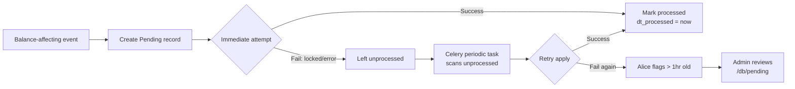

# Pending Policy — When Changes Queue vs Apply Immediately

## The Two Rules

### Rule 1: Financial balances → Pending always

Any change that affects **inventory quantities** or **cash/payment balances**
creates a Pending record, even if the target record is unlocked.

These are balance-affecting events. They need:
- An audit trail (who changed what, when, why)
- The ability to catch errors before the number moves
- Batch review capability (Alice or admin reviews Pending queue)
- Retry on failure (DB lock, network error, concurrent edit)

| Change | Target | Pending always? |
|--------|--------|----------------|
| Inventory on_hand adjustment | Item.quantity | **YES** |
| Inventory on_so from order | Item.quantity | **YES** |
| Inventory on_po from purchase | Item.quantity | **YES** |
| Payment applied to invoice | Invoice.totals.received | **YES** |
| Payment created (received or expense) | Ledger balance | **YES** |
| GL journal entry | GlJournal | **YES** |
| Ledger sync (invoice → org balance) | OrgBase.financial | **YES** |
| BOM cost roll-up | Item.cost | **YES** |

### Rule 2: Everything else → Apply now, unless locked

Non-financial denormalization applies immediately. If the target record is
locked (journalized, reconciled, frozen), create a Pending instead.

| Change | Target | Unlocked | Locked |
|--------|--------|----------|--------|
| refs.bom denorm | Item.refs | Apply now | Pending |
| refs.links denorm (contact, org) | Any.refs | Apply now | Pending |
| refs.keywords rebuild | Any.refs | Apply now | Pending |
| Display name denorm | Transaction.refs | Apply now | Pending |
| Commission accrual stamp | Invoice.metadata | Apply now | Pending |

## The Decision Test

Ask: **Does this change affect a number someone relies on for financial decisions?**

- If yes → Pending always. No exceptions. No "it's just a small adjustment."
- If no → Apply now. Unless locked, then Pending.

## Pending Record Structure

```python
Pending.objects.create(
    model_name='item',              # target model
    record_id='42',                 # target record PK
    purpose='inventory_adjust',     # what kind of change
    name='Adjust on_hand: Item BB200 +5',  # human-readable
    data={
        'field': 'quantity.on_hand',  # specific field being changed
        'delta': 5,                   # the change amount
        'reason': 'receipt_from_po',  # why
        'source_model': 'purchase',   # what triggered it
        'source_id': 1234,            # originating document
    },
)
```

## Purpose Values

| Purpose | What it does | Financial? |
|---------|-------------|-----------|
| `inventory_adjust` | Change Item.quantity bucket | YES |
| `inventory_reserve` | Allocate specific inventory to order | YES |
| `ledger_sync` | Update org balance from invoice/payment | YES |
| `payment_apply` | Apply payment to invoice balance | YES |
| `gl_post` | Create GL journal entries | YES |
| `denorm_refs` | Update refs.bom, refs.links, etc. | NO — queued only if locked |
| `denorm_keywords` | Rebuild search keywords | NO — queued only if locked |
| `cost_rollup` | BOM cost recalculation | YES |

## Processing — The Pending → Celery Pipeline

Pending records are the queue. Celery is the worker. They are separate concerns.



### Step 1: Create Pending (synchronous, in the save path)

The code that detects the change creates the Pending record immediately.
This is synchronous — it happens inside the save transaction. The Pending
record is the audit trail. It exists even if processing fails.

### Step 2: Immediate attempt (synchronous, best-effort)

Right after creating the Pending, the same code tries to apply the change.
If the target record is unlocked and the DB cooperates, it succeeds and
marks the Pending as processed (`dt_processed = now_ms`). Done.

If it fails (record locked, version conflict, DB error), the Pending stays
unprocessed. No exception raised — the caller's save completes normally.

### Step 3: Celery retry (asynchronous, periodic)

Celery Beat schedules periodic tasks that scan for unprocessed Pending records:

| Task | Frequency | Scans for |
|------|-----------|-----------|
| `process_pending_financial` | Every 5 minutes | `purpose` in (inventory_adjust, ledger_sync, payment_apply, gl_post, cost_rollup) |
| `process_pending_denorm` | Every 15 minutes | `purpose` in (denorm_refs, denorm_keywords) |

Each task:
1. Queries `Pending.objects.filter(dt_processed=0).order_by('dt_created')`
2. For each record, attempts to apply the change
3. On success: `pending.mark_processed(save=True)`
4. On failure: increments `pending.data['retry_count']`, logs the error
5. After 10 retries: marks as `purpose='failed'` for manual review

### Step 4: Alice escalation

Alice's nightly reflection scans for:
- Pending records older than 1 hour (unprocessed) → warning
- Pending records older than 24 hours → escalate to admin dashboard
- Pending records with `purpose='failed'` → create an Action for admin

### Celery configuration

```python
# webclerk3_api/celery.py — Beat schedule
CELERY_BEAT_SCHEDULE = {
    'process-pending-financial': {
        'task': 'apps.core.tasks.process_pending_financial',
        'schedule': 300.0,   # every 5 minutes
    },
    'process-pending-denorm': {
        'task': 'apps.core.tasks.process_pending_denorm',
        'schedule': 900.0,   # every 15 minutes
    },
}
```

### Without Celery (single-machine dev)

If Celery is not running (common in dev), Pending records accumulate.
The admin can process them manually:

```bash
./venv/bin/python3 manage.py process_pending        # run all pending now
./venv/bin/python3 manage.py process_pending --type financial  # just financial
```

Or via the databrowser: open `/db/pending`, review, and process individually.

### The Pending model fields

| Field | Purpose |
|-------|---------|
| `model_name` | Target model (item, invoice, orgbase) |
| `record_id` | Target record PK |
| `purpose` | What kind of change (inventory_adjust, ledger_sync, denorm_refs) |
| `name` | Human-readable description |
| `data` | JSON payload — the change to apply |
| `dt_created` | When the Pending was created (epoch ms) |
| `dt_processed` | When it was applied (0 = not yet) |

### Step 5: Manual review

Alice flags Pending records older than 1 hour.
Admin reviews in the databrowser at `/db/pending`.

## What Pending Prevents

- **Silent balance changes** — every inventory/cash change is visible in the queue
- **Lost updates from locks** — denorm doesn't silently fail when a record is frozen
- **Concurrent edit conflicts** — Pending serializes balance changes
- **Audit gaps** — every financial change has a Pending record with source, reason, timestamp

## Cross-References

- **Inventory flow**: `readmes/inventory_flow_testing.md` — quantity buckets, transaction types
- **Ledger system**: `readmes/ledger-financial-system.md` — org balances, aging, reconciliation
- **JSON envelope policy**: `readmes/json-envelope-policy.md` — where Pending data lives vs metadata
- **Setting policy**: `readmes/setting-policy.md` — Pending processing frequency in system settings
- **Ledger balance service**: `apps/accounts/services/ledger_balance.py` — uses Pending for sync
- **BOM denorm**: `apps/products/models/bill_of_material.py` — creates Pending if parent locked

## The Principle

Money and inventory are the two things a business cannot afford to get wrong.
Every other data error is cosmetic — a wrong name, a stale denorm, a missing
keyword. Those fix themselves on the next save or the next sync.

A wrong inventory count ships the wrong order. A wrong cash balance approves
a credit that shouldn't be extended. These errors cost real money and real
customers. The Pending queue is the guardrail.
