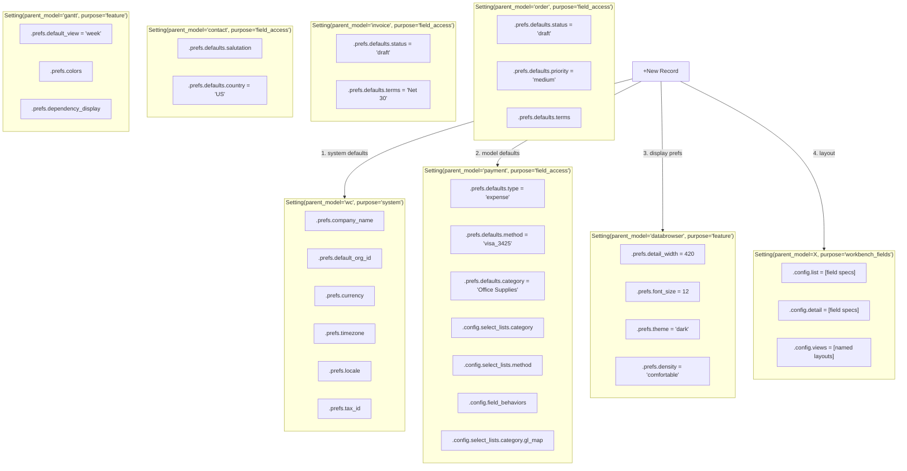
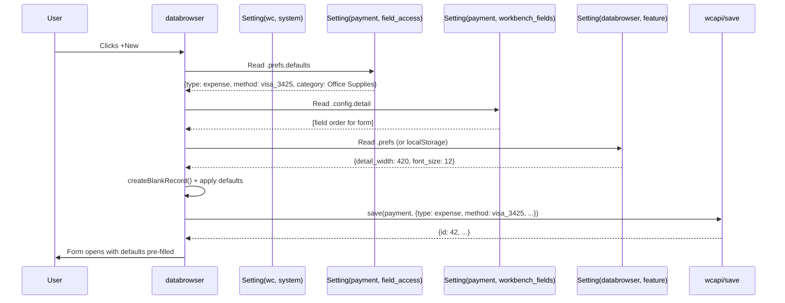

# Prefs Architecture — Where Defaults Come From

## The Three Tiers

## Flow: Creating a New Payment

## The Rule

| Question | Answer |
|----------|--------|
| Is it about the company? | `Setting(wc, system).prefs` |
| Is it about how a model behaves? | `Setting(model, field_access).prefs` |
| Is it about how a model displays? | `Setting(model, workbench_fields).config` |
| Is it about a feature that isn't a model? | `Setting(feature_name, feature).prefs` |
| Is it about a specific record? | `record.prefs` (rare — userdefined fields) |
| Is it system/audit data? | `record.metadata` (GL postings, sync state, audit trail) |

## What Does NOT Go in Prefs

- **Record data** — amount, contact, date. That's model fields.
- **Audit trail** — GL postings, sync state. That's `.metadata`.
- **Computed values** — totals, balances. That's server-calculated.
- **User identity** — login, role, permissions. That's the User/UserProfile model.

## Where Record-Level `.prefs` Is Used

The `.prefs` JSONField on individual records is reserved for:

- **`prefs.userdefined`** — custom fields the user added to this record
- **`prefs.pinned`** — user pinned this record for quick access
- **`prefs.tags`** — user-applied tags (not categories — tags are personal)

These are record-level, user-initiated. Not defaults, not system config.

## Alice's Role

Alice observes usage patterns and recommends changes to Setting.prefs.defaults:

- 80% of expenses use "visa_3425" → confirm as default
- New category typed repeatedly → suggest adding to select list
- Users override a default consistently → suggest changing the default
- New user joins → Alice explains the current defaults and shows entry points

Alice never changes defaults without admin approval. She recommends.
The admin promotes. The pattern: `observe → log → pattern → recommend → promote`.
