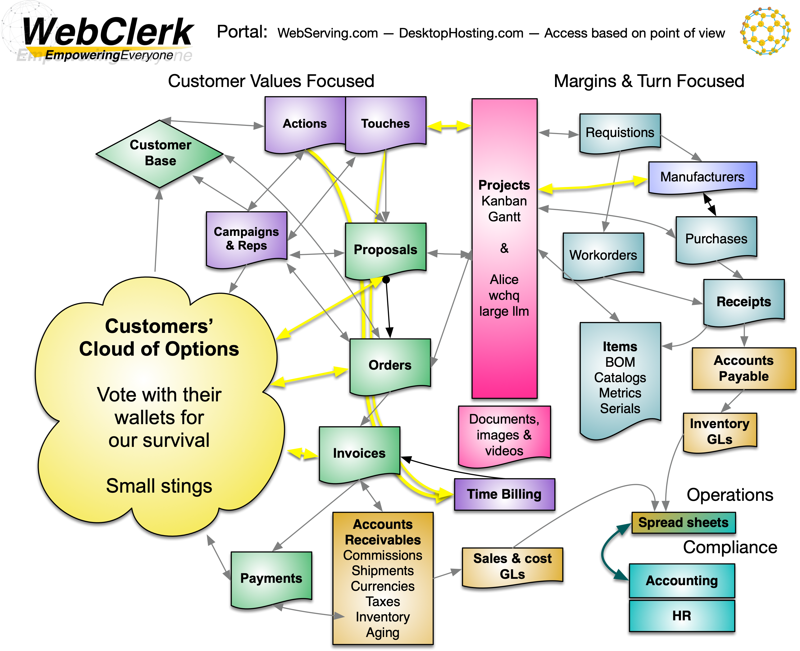

# Financial Reporting — The Accounting Boundary

**Updated:** 2026-09-13
**Status:** Architectural decision — permanent

---

## The Architecture



The boundary is visible in the bottom right of this diagram: **Operations → Spread sheets → Compliance → Accounting / HR**. WebClerk produces operational data on both sides — customer-focused (Proposals → Orders → Invoices → Payments → AR) and margin-focused (Requisitions → Purchases → Receipts → AP → Inventory GLs). Both sides generate GL journals. Spreadsheets are the handoff layer to compliance. Accounting and HR are downstream certified systems.

---

## The Mission

WebClerk's mission is **empowering margin-velocity** — helping businesses see what they're making, what they're losing, and where to push. Providing certified accounting reports is handed to those certified to produce those reports.

WebClerk is an operational engine. It tracks proposals, orders, invoices, purchases, receipts, and cash. It produces GL journal entries from those transactions. That is where WebClerk's responsibility ends.

**P&L, Balance Sheet, Trial Balance, and Bank Reconciliation are not WebClerk features.** They never were and never will be. These are compliance artifacts produced by certified professionals using their own tools.

---

## Why Spreadsheets

At WebClerk and JPods we use spreadsheets and database systems that behave like spreadsheets because they are the best interface between operational data and compliance reporting.

Every accountant on earth knows Excel. Every auditor expects working papers in spreadsheet form. Building a proprietary P&L renderer inside WebClerk would produce an inferior spreadsheet that:

- No accountant asked for
- No auditor will accept as a working paper
- No user can customize to their business
- Removes professional judgment from the compliance process

Every accounting scandal in history happened inside a system that claimed to produce compliant reports without accountant oversight. WebClerk does not make that claim. We produce clean operational data. Certified professionals produce certified reports.

---

## The Data Flow

```
┌─────────────────────────────────────────────────────────────────┐
│                        WEBCLERK                                 │
│                                                                 │
│  Proposal → Order → Invoice → Cash In     (sales cycle)        │
│  Purchase → Receipt → Cash Out            (procurement cycle)  │
│                                                                 │
│  Each transaction generates GL Journal entries                  │
│  (GlJournal records with account, debit, credit, batch_id)     │
│                                                                 │
│  GL Export:  Generic CSV · QuickBooks IIF · Xero · Sage         │
└──────────────────────────┬──────────────────────────────────────┘
                           │
                    GL Journal Export
                    (CSV / JSON / IIF)
                           │
                           ▼
┌─────────────────────────────────────────────────────────────────┐
│                     SPREADSHEET / DATABASE                      │
│                                                                 │
│  Budget (planned)  ←→  Actuals (from WebClerk)                 │
│                                                                 │
│  P&L:  Revenue - COGS = Gross Margin - Expenses = Net Income   │
│  Balance Sheet:  Assets = Liabilities + Equity                  │
│  Trial Balance:  Sum of all accounts, debits = credits          │
│  Bank Reconciliation:  Cash records vs bank statement           │
│                                                                 │
│  The user owns this. They customize it. They certify it.        │
└─────────────────────────────────────────────────────────────────┘
```

**Two feeds into the spreadsheet:**

1. **Budget** — planned numbers, built in the spreadsheet itself or imported from a planning tool. The budget CSV format (`period, account, debit, credit, description`) can also be imported into WebClerk as baseline data.

2. **Actuals** — WebClerk exports operational transactions via GL Export. Format: `Date, Account, Debit, Credit, Description, Reference, Division, Source`. Available as Generic CSV, QuickBooks IIF, Xero CSV, or Sage CSV.

The spreadsheet compares budget vs actual, adds non-operational adjustments (depreciation, debt service, tax provisions), and produces compliant financial statements.

---

## The Tools

### WebClerk Library (webclerk.com/library/)

Free, community-maintained spreadsheet templates:

| Template | What it does |
|----------|-------------|
| **Bank Reconciliation Starter** | Two-section worksheet: paste Cash export + bank statement, match transactions, auto-calculate variance |
| **P&L / Balance Sheet** | Browser-based tool + downloadable CSV. Monthly Year 1, annual Years 2-5. Import WebClerk GL actuals. Save/load JSON. |

Users download starter templates, customize them, and upload improved versions back to the community.

### Statement Sorter (webclerk.com/sort/)

Free tool that parses bank statements (CSV from any bank) and categorizes transactions.

**Statement Sorter offers two paths. Users choose:**

**Path 1 — Spreadsheet (strongly recommended):** Statement Sorter categorizes the bank statement → output goes to the reconciliation spreadsheet → accountant matches against WebClerk Cash export → working paper stays outside WebClerk. Expenses live in the spreadsheet where the accountant controls them. WebClerk never sees the bank statement. This is the correct boundary for any business that has an accountant, bookkeeper, or plans to.

**Path 2 — Import into WebClerk (acceptable, least preferred):** Statement Sorter categorizes → import as Cash records (`type=cash_out`, `category` maps to GL via Setting select_list). This is for solo operators who are their own accountant and just need expenses in the system. It works, but it treats bank statement lines as operational transactions — which they are not. They are the bank's record, not the business's. An accountant can still export and reconcile later, but the data is now inside WebClerk where it adds complexity without adding operational value.

**Why we strongly recommend Path 1:** Expenses are not operational transactions. A sale is operational — WebClerk tracks it from proposal to invoice to cash. An expense is a compliance event — the accountant categorizes it, allocates it, and reports it. Putting expenses inside WebClerk means WebClerk is doing accounting work. That crosses the boundary. Spreadsheets are where expenses belong — the accountant knows the chart of accounts, the allocation rules, and the tax implications. WebClerk does not.

### GL Export (built into WebClerk)

Five export formats, all producing the same balanced journal entries:

| Format | File | Target |
|--------|------|--------|
| Generic CSV | `YYYY-MM_gl_journal.csv` | Any program, spreadsheets |
| Generic JSON | `YYYY-MM_gl_journal.json` | API consumers, custom tools |
| QuickBooks IIF | `YYYY-MM_gl_journal.iif` | QuickBooks Desktop |
| Xero CSV | `YYYY-MM_gl_journal_xero.csv` | Xero manual journal import |
| Sage CSV | `YYYY-MM_gl_journal_sage.csv` | Sage 50 / Peachtree |

---

## What WebClerk Does and Does Not Do

### WebClerk does:
- Track operational transactions (proposals, orders, invoices, purchases, receipts, cash)
- Generate balanced GL journal entries from those transactions
- Export GL journals in multiple accounting program formats
- Track accounts receivable aging and collections
- Track margin erosion (proposal → order → invoice price drift)
- Provide Alice pattern recognition on operational data

### WebClerk does not:
- Produce P&L, Balance Sheet, or Trial Balance reports
- Perform bank reconciliation
- Calculate depreciation or amortization
- File taxes or produce tax documents
- Close accounting periods (it locks GL entries via `dt_journalized` — period close is the accountant's job)
- Replace professional accounting judgment

### The boundary:
- **WebClerk** = "What happened in the business" (operational truth)
- **Spreadsheet/Accounting system** = "What it means for compliance" (certified truth)
- **GL Journal Export** = the handoff between them

---

## Connection + Bundle for Bank Reconciliation

Bank accounts and payment gateways are modeled as **Connection** records (type=`bank` or `gateway`, purpose=`reconciliation`). Each bank statement import creates **Bundle** records on that Connection.

Reconciliation is export/import through spreadsheets:
1. Export Cash records from WebClerk
2. Sort bank statement with Statement Sorter
3. Match in the reconciliation spreadsheet
4. The spreadsheet is the working paper — save it for the auditor

---

## Flowchart Reference

- `wc3-06-finance-a-payment-gl` — Payment → GL journal flow
- `wc3-16-focus-of-responsibility` — WebClerk / Accounting / Time / HR boundary map

See `readmes/flowcharts/INDEX.md` for the complete flowchart index.

---

## What Was Removed (2026-09-13)

The following were removed from WebClerk as part of establishing this boundary:

- `apps/accounts/services/financial_statements.py` — contained `trial_balance()`, `income_statement()`, `balance_sheet()` functions
- Manage view dispatch entries for `get_trial_balance`, `get_income_statement`, `get_balance_sheet`
- Seed report entry for Trial Balance
- `PaymentMethod` model — replaced by Setting select_list on Cash.method
- `PaymentTerm` model — retired; all FKs repointed to `accounts.Term`

These were operational approximations of accounting reports. They belonged in the accountant's tools, not in WebClerk.
