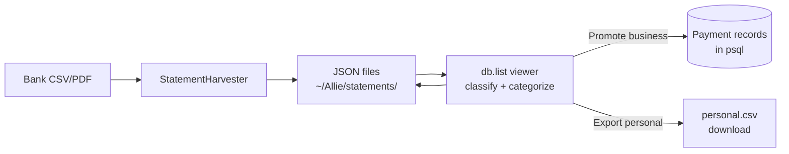

# StatementHarvester — JSON-Based Statement Processing

## Architecture

Statements live as JSON files on disk, never in the database.
Only promoted business lines become Payment records in psql.
Personal data never enters the company database.



## Why JSON, Not Database Records

1. **Privacy** — personal financial data never enters the company database
2. **Sovereignty** — the user owns their JSON files, not the installation
3. **Portability** — JSON files travel with the user (MyCarryOn, USB, cloud)
4. **Idempotency** — each line has a UUID; promote 10 times, get 1 Payment
5. **Simplicity** — no migrations, no model changes, no psql maintenance

## Statement Line Schema

Each line in the JSON file:

```json
{
  "uuid": "c1d19c00-04ed-4b63-a592-70a383f23a89",
  "dt_transaction": "2025-01-13T00:00:00Z",
  "description": "DIGITALOCEAN.COM NEW YORK NY",
  "amount": -12.37,
  "source": "wellsfargo_cc",
  "raw_text": "Jan 2025,01/13,DIGITALOCEAN.COM...",
  "classification": "unknown",
  "category": "",
  "ledger": "post",
  "promoted": false,
  "payment_id": null,
  "merchant": "",
  "bank_category": "Hosting / Software",
  "metadata": {}
}
```

**UUID** — assigned at harvest time. Used for idempotent promotion.
When a line is promoted to a Payment, the UUID goes into
`payment.refs.source.statement_uuid`. If that UUID already exists
in any Payment, skip — no duplicates.

**classification** — unknown / business / personal. User sets, Alice suggests.

**category** — expense bucket (same select list as Payment.category).
Maps to GL via Setting.

**ledger** — post / skip / review. Controls whether promotion creates GL entries.

**promoted** — set to true after successful promotion. `payment_id` set to the
created Payment's PK.

## Usage

### Harvest (CSV → JSON)

```bash
# Harvest a folder — auto-detects banks, saves JSON files
python3 tools/statement_harvester.py ~/Taxes/2025/

# Output to a specific directory
python3 tools/statement_harvester.py ~/Taxes/2025/ --out ~/MyStatements/

# Preview as JSON to stdout
python3 tools/statement_harvester.py ~/Taxes/2025/ --preview

# Check for missing expected accounts
python3 tools/statement_harvester.py ~/Taxes/2025/ --check
```

### Promote (JSON → Payment records)

```bash
# Promote business lines from a JSON file to Payment records
./venv/bin/python3 tools/statement_harvester.py ~/Allie/statements/wellsfargo_cc-20260801.json --promote
```

### API Endpoints

| Endpoint | Method | What it does |
|----------|--------|-------------|
| `/api/transactions/statements/harvest/` | POST | Harvest CSVs → JSON files |
| `/api/transactions/statements/files/` | GET | List JSON files with summaries |
| `/api/transactions/statements/lines/` | GET | Load lines from a JSON file |
| `/api/transactions/statements/save/` | POST | Save classification changes back |
| `/api/transactions/statements/promote/` | POST | Promote business → Payment records |
| `/api/transactions/statements/export/` | GET | Export personal lines as CSV |

## Supported Bank Formats

| Bank | Detection | Key columns |
|------|-----------|-------------|
| Wells Fargo CC (2025+) | "Month" + "Post Date" headers | month, post_date, description, amount |
| Wells Fargo (legacy) | No header, col[2]="*" | date, amount, *, empty, description |
| USAA | "Original Description" header | date, description, orig_desc, category, amount, status |
| Wise | "Direction" + "Source fee amount" | created, direction, source_amount, target_name |
| Domain Registrar | "Receipt number" + "Order total" | order_date, product, name, total |
| Generic | "date" + "amount" headers | date, amount, description |

## File Organization

```
~/Allie/statements/
  wellsfargo_cc-20260801.json      ← one file per source per harvest date
  wellsfargo_checking-20260801.json
  usaa-20260801.json
  wise-20260801.json
  registrar-20260801.json
  generic-20260801.json
  _expected_accounts.json          ← Alice's learned account list
```

## Alice's Role

- **Learns accounts** — remembers which banks/cards to expect
- **Warns about missing** — "⚠ MISSING: USAA — no statement in this folder"
- **Learns merchants** — DIGITALOCEAN.COM → always business, Hosting
- **Suggests categories** — based on merchant patterns from prior classifications
- **Coaches onboarding** — "Drop your statements into a folder and click Harvest"

## The Principle

The user's financial data belongs to the user. The company database only
gets what the user explicitly promotes. Personal lines export as CSV and
leave the system. The JSON file is the working space — classify, categorize,
promote. The database is the destination — only for business records that
need GL entries, aging, and reconciliation.
