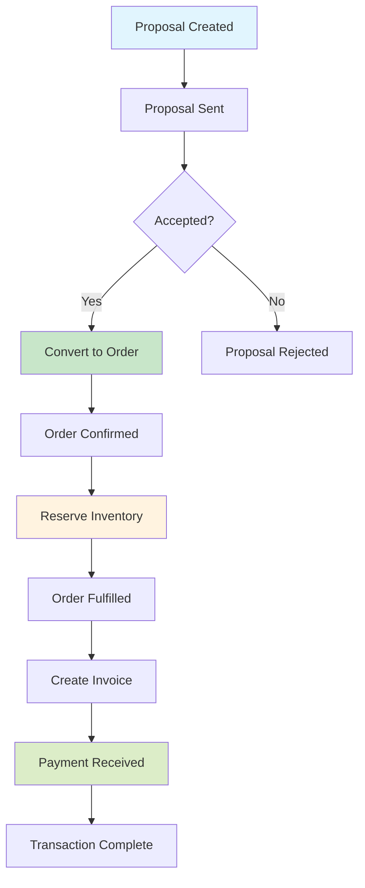

# Transaction Flows in WebClerk3

## Overview

WebClerk3 implements a comprehensive transaction flow system that manages the complete lifecycle of commercial transactions from initial proposals through fulfillment and payment. This system salvages practical business logic from WebClerk2 while modernizing the architecture with Django models, JSONB fields, and React2025 frontend integration.

### Core Transaction Flow



The primary flow follows: **Proposal → Order → Purchase → Invoice → Payment**

## Transaction Lineage — `parent_model` / `parent_id`

Every transaction header has two fields on `TransactionBaseModel` that track **which transaction created it**:

| Field | Type | Purpose |
|-------|------|---------|
| `parent_id` | `BigIntegerField` | PK of the source transaction |
| `parent_model` | `CharField(20)` | Discriminator: `proposal`, `order`, `invoice`, `purchase`, `workorder`, `requisition` |

This is a **polymorphic pattern** (not a true FK). It answers: *"This order was created from proposal #42."*

### Parent-child chains

```
Proposal #42  ──parent_of──▶  Order #61  ──parent_of──▶  Invoice #85
                               │
                               └──parent_of──▶  Purchase #39  ──parent_of──▶  Receipt (via FK)
```

When a transfer service converts one transaction to another, it sets:
```python
new_order.parent_model = "proposal"
new_order.parent_id    = proposal.pk
```

### Line-level lineage

Lines track their source line via `refs.source` and `refs.xfer` JSONB:
```json
{
  "refs": {
    "source": { "model": "proposal_line", "id": 101 },
    "xfer":   { "version": 1, "transferred_at": "2026-02-17T..." }
  }
}
```

## Quantity Model — `staged` / `active` / `remaining` / `children_active`

All line types use a unified `quantity` JSONB with these canonical keys:

| Key | Meaning |
|-----|---------|
| `staged` | Quantity received from parent (frozen after creation) |
| `active` | User's working quantity — **never modified by the system** |
| `remaining` | `active − children_active["sum"]` (or `active` if no children) |
| `children_active` | Denormalized tracker: `{"sum": N, "lines": [{"id": X, "active": Y}, ...]}` |

Additional keys: `is_fixed`, `precision`, `is_blanket`, `increment`.

**Universal remaining formula:**

```
remaining = active − children_active["sum"]
```

When a line has no children, `children_active` is absent and `remaining = active`.

## Transaction Models

All transaction models inherit from `TransactionBaseModel` which provides:

- Common fields: `status`, `customer_id`, `vendor_id`, etc.
- JSONB fields: `cost`, `sell`, `finance`, `flow`, `source`, `action`
- Status workflow: planned → released → in_progress → complete/canceled

### Core Models

- **Proposal**: Initial estimates/quotes with line items
- **Order**: Confirmed customer orders
- **Purchase**: Procurement orders to vendors
- **Invoice**: Billing documents with tax calculations
- **Payment**: Payment records with gateway integration

### Line Item Models

Each transaction type has corresponding line models:

- `ProposalLine`
- `OrderLine`
- `PurchaseLine`
- `InvoiceLine`
- `PaymentApplication`

## Business Logic from WebClerk2

WebClerk3 salvages key business logic patterns from WebClerk2 (4D implementation):

### Transfer Services

Core transfer utilities in `apps/transactions/services/`:

- `proposal_to_order.py`: Converts proposals to orders
- `order_to_invoice.py`: Converts orders to invoices
- `flow.py`: Core transfer utilities and inventory receiving

### Inventory Receiving Functions

The `flow.py` module provides specialized functions for inventory receiving:

| Function | Source Type | Use Case |
|----------|-------------|----------|
| `receive_purchase()` | Purchase | Receiving goods from vendors |
| `complete_workorder()` | Work Order | Completing manufacturing |
| `adjust_inventory()` | Manual | Adjustments, cycle counts, write-offs |
| `receive_inventory_changes()` | Dispatcher | High-level routing to above functions |

Example usage:

```python
from apps.transactions.services.flow import (
    receive_purchase, ReceiveLine,
    complete_workorder, CompleteWorkOrderLine,
    adjust_inventory, AdjustmentLine,
    receive_inventory_changes
)

# Receive against a PO
lines = [ReceiveLine(po_line_id=123, qty=10, warehouse_code='MAIN')]
receive_purchase(po, 'RCV-001', lines)

# Complete a workorder
lines = [CompleteWorkOrderLine(wo_line_id=456, qty_completed=50, warehouse_code='FG')]
complete_workorder(wo, 'WO-COMP-001', lines)

# Manual adjustment
lines = [AdjustmentLine(item_id=100, qty_delta=-5, warehouse_code='MAIN', reason='damage')]
adjust_inventory('ADJ-001', lines, notes='Damaged in shipping')

# Or use the dispatcher
receive_inventory_changes('purchase', po, 'RCV-002', receive_lines)
```

See [Inventory Deltas](../inventory/inventory_deltas.md#inventory-receiving-functions) for detailed documentation.

### Totals Calculation

Automatic computation of sell/cost/totals from lines using patterns from WebClerk2:

- Header-level totals stored in JSONB fields
- Line-level calculations with tax and discount handling
- Margin analysis and cost tracking

### Status Workflow Management

Business rules for transaction state transitions:

- Proposals can only convert to orders when accepted
- Orders can only invoice when fulfilled
- Payments can only apply to sent invoices

### Inventory Integration

Basic inventory receiving and reservation logic carried forward from WebClerk2.

## JSONB Usage in Transactions

Transactions leverage PostgreSQL JSONB fields for flexible, searchable data storage:

### Cost Field

```json
{
  "line_sum_goods": 1000.00,
  "line_sum_tax": 80.00,
  "handling": 50.00,
  "freight": 25.00,
  "tax_rate": 0.08,
  "tax": 80.00,
  "total": 1155.00
}

```

### Sell Field

```json
{
  "subtotal": 1200.00,
  "discount": 50.00,
  "taxable": 1150.00,
  "tax": 92.00,
  "shipping": 30.00,
  "total": 1272.00,
  "cost": 1000.00,
  "margin": 272.00,
  "margin_pc": 21.4
}

```

### Finance Field

```json
{
  "sales_tax_id": 1,
  "sales_tax_rate": 0.08,
  "cost_tax_rate": 0.06,
  "collection_expense": 5.00
}

```

### Flow Field

```json
{
  "source": [{"type": "proposal", "id": 123}],
  "children": [{"type": "order", "id": 456}]
}

```

### Source Field

```json
{
  "campaign_id": 1,
  "catalog_id": 2,
  "vendor_id": 10
}

```

### Action Field

```json
{
  "action_next": {"who": "user@example.com", "when": 1640995200000, "what": "review"}
}

```

These JSONB fields enable:

- Flexible schema evolution without migrations
- Complex queries on nested data
- Efficient indexing for common filters
- Audit trails and metadata storage

## React2025 Integration

Transaction management integrates with React2025 frontend through modern React components:

### Component Architecture

```aaa
src/components/transactions/
├── common/
│   ├── TransactionHeader.tsx
│   ├── TransactionLines.tsx
│   ├── TransactionTotals.tsx
│   └── AuditTrail.tsx
├── proposals/
│   ├── ProposalForm.tsx
│   ├── ProposalList.tsx
│   └── ProposalConverter.tsx
├── orders/
│   ├── OrderForm.tsx
│   ├── OrderList.tsx
│   └── OrderStatusTracker.tsx
├── payments/
│   ├── PaymentForm.tsx
│   ├── PaymentProcessor.tsx
│   └── PaymentHistory.tsx
└── hooks/
    ├── useTransaction.ts
    ├── useWCAPI.ts
    └── useRealTimeCalculations.ts

```

### Key Features

- **Real-time Calculations**: Automatic totals updates as line items change
- **Multi-currency Support**: Exchange rate handling with conversion
- **Audit Trails**: Complete transaction history with user actions
- **WCAPI Integration**: RESTful API endpoints for CRUD operations
- **State Management**: Redux slices for transaction state

### API Integration

Components use WCAPI endpoints:

- `GET /api/wcapi/?model_name=proposal` - List proposals
- `POST /api/wcapi/save/` - Create/update transactions
- `GET /api/wcapi/?model_name=invoice&id=123` - Get specific transaction

## Testing Procedures

### Running Tests

```bash
# Full test suite
./bin/pytest -q

# Transaction-specific tests
./bin/pytest apps/transactions/tests/ -v

# Single test file
./bin/pytest apps/transactions/tests/test_proposal_models.py

# With coverage
coverage run -m pytest apps/transactions/tests/ && coverage report

```

### Test Categories

- **Unit Tests**: Model validation, service functions, calculations
- **Integration Tests**: Complete flow testing (proposal → order → invoice → payment)
- **API Tests**: WCAPI endpoint validation
- **Frontend Tests**: React component testing

### Test Files

- `test_proposal_models.py`: Proposal model validation
- `test_proposal_serializers.py`: API serialization
- `test_proposal_services.py`: Business logic services
- `test_proposal_integration.py`: End-to-end flow testing

## Management Commands for Demo Data

### Sample Product Data

Create sample vendors, customers, catalogs, and items:

```bash
python manage.py seed_sample_products

```

This creates:

- Sample Vendor and Customer organizations
- SAMPLE-CAT catalog with items (apples, bananas, carrots)
- OrgItem links with quantity constraints

### Transaction Demo Data

Currently, no dedicated transaction seeding command exists. Create demo transactions manually via:

1. WCAPI endpoints
2. Django admin interface
3. Direct model instantiation in shell

Future enhancement: Add `seed_sample_transactions` management command.

## Validating Transaction Flows

### Manual Validation Steps

1. **Create Proposal**:
   - Add customer, items, pricing
   - Verify totals calculation
   - Check status: planned

2. **Convert to Order**:
   - Validate proposal completeness
   - Transfer line items with quantities
   - Reserve inventory
   - Update statuses

3. **Create Invoice**:
   - Check order fulfillment
   - Calculate taxes and totals
   - Update inventory quantities

4. **Apply Payment**:
   - Process payment via gateway
   - Update invoice balance
   - Reconcile transaction

### Automated Validation

Run integration tests to validate complete flows:

```bash
./bin/pytest apps/transactions/tests/test_proposal_integration.py -v

```

### Business Rule Checks

- Proposals → Orders: Only accepted proposals
- Orders → Invoices: Only fulfilled orders
- Payments → Invoices: Only sent invoices
- Inventory: Quantities update correctly
- Totals: Calculations match expected values

### API Validation

Test WCAPI endpoints:

```bash
# List transactions
curl "http://localhost:8000/api/wcapi/?model_name=proposal"

# Create transaction
curl -X POST "http://localhost:8000/api/wcapi/save/" \
  -H "Content-Type: application/json" \
  -d '{"model_name": "proposal", "data": {...}}'

```

### Frontend Validation

1. Navigate to transaction pages in React2025
2. Test form submissions and data persistence
3. Verify real-time calculations
4. Check status workflow transitions

## Dependencies

### Backend

- Django REST Framework
- PostgreSQL (for JSONB support)
- Stripe/PayPal SDKs (for payments)

### Frontend

- React2025 framework
- React Query for API state
- Redux for transaction state management

## Future Enhancements

- Recurring transaction billing
- Multi-currency exchange rate management
- Advanced approval workflows
- Document generation (PDF invoices)
- ERP system integrations
- Analytics and reporting dashboards
