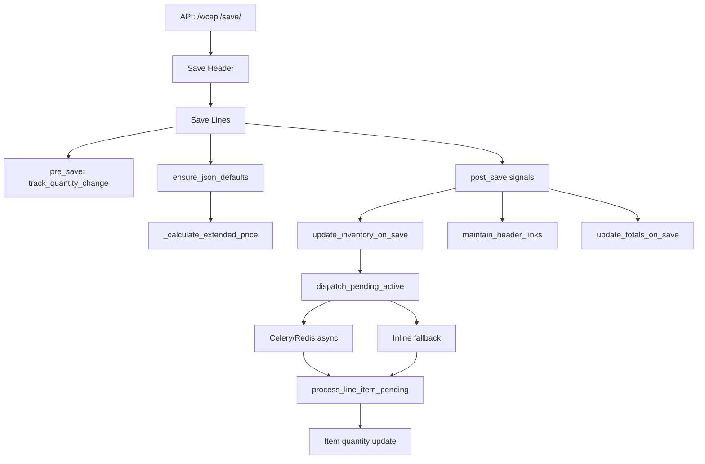

# Transactions: Line Calculations, Quantity Flow & Totals Rollup

> **Last updated**: 2026-03-07

---

## Quick Reference: Quantity Semantics

### `quantity.active` is the verb of the document

The meaning of `active` changes by document type — it IS the action:

| Document | `quantity.active` means |
|----------|------------------------|
| proposal_line | quantity being **proposed** |
| order_line | quantity being **ordered** |
| invoice_line | quantity being **shipped** |
| purchase_line | quantity being **purchased** |
| receipt_line | quantity being **received** |
| workorder_line | quantity being **produced** |

There is no `shipped` or `picked` or `received` key. The document type
gives the quantity its meaning. Invoice line active=6 means 6 shipped.
Order line active=10 means 10 ordered. Order remaining=4 means 4 not
yet shipped. The data is already there — look at the right document.

### The three canonical keys

| Field | Role | Source |
|-------|------|--------|
| `active` | The verb — what this line is acting on | **User input** — the primary quantity |
| `staged` | What was allocated FROM the parent | Frozen at transfer time (= `parent.remaining`); mirrors `active` for standalone |
| `remaining` | What's available FOR children | `active − sum(children.active)` |

### Standalone vs Transferred Lines

| Origin | How line is created | `staged` source | `active` source |
|--------|---------------------|-----------------|---------------------|
| **Standalone** | User creates new line | Mirrors `active` | User input |
| **Transferred** | Transfer service creates | `parent.remaining` | Initially = `staged` (user may reduce) |

### The Universal Remaining Formula

```
remaining = active − sum(children.active)
```

This applies to **all** transaction types, all levels.
A line with no children yet: `remaining = active` (sum is 0).

| Type | Standalone (no children) | With children |
|------|--------------------------|---------------|
| Proposal | `remaining = active` | `active − sum(order.active)` |
| Order | `remaining = active` | `active − sum(invoice.active)` |
| Purchase | `remaining = active` | `active − sum(receipt.active)` |
| WorkOrder | `remaining = active` | `active − sum(completion.active)` |
| Invoice | `remaining = active` | `active − sum(children.active)` |
| Receipt | `remaining = active` | `active − sum(children.active)` |

### Transfer Equation

When a child is created from a parent:

```
child.staged  = parent.remaining             # frozen allocation
child.active  = child.staged                  # initially full amount
child.remaining = child.active                # no grandchildren yet

parent.remaining = parent.active − sum(children.active)   # recalculated
```

When the user reduces `child.active`, the difference flows back to
the parent's `remaining` automatically (parent recalculates from sum).

### `children_active` — Denormalized Tracker

Each parent line stores a `children_active` object in its quantity map
so remaining can be computed without querying child tables:

```json
{
  "children_active": {
    "sum": 4,
    "lines": [
      {"id": 23, "active": 3},
      {"id": 24, "active": 1}
    ]
  }
}
```

`remaining = active − children_active.sum`

---

## Code Path Index

Quick reference to the source files discussed in this document:

| Concern | File | Key symbols |
|---------|------|-------------|
| JSON defaults & extended calc | `apps/transactions/models/base_line_model.py` | `default_quantity()` :78, `normalize_quantity_map()` :130, `BaseLineCore` :283, `ensure_json_defaults()` :327, `BaseSellLineModel` :363, `_calculate_extended_price()` :388, `BaseExecLineModel` :431 |
| Totals rollup (sell-side) | `apps/transactions/services/proposal_totals.py` | `compute_proposal_sell_cost_totals()` :12 |
| | `apps/transactions/services/order_totals.py` | `compute_order_sell_cost_totals()` :12 |
| | `apps/transactions/services/invoice_totals.py` | `compute_invoice_sell_cost_totals()` :12 |
| Totals rollup (exec-side) | `apps/transactions/services/purchase_totals.py` | `compute_purchase_sell_cost_totals()` :12 |
| | `apps/transactions/services/po_totals.py` | `compute_purchase_cost_totals()` :8 |
| Transfer: quantity conversion | `apps/transactions/services/transfer_utils.py` | `convert_quantity_from_source()` :21, `build_line_payload()` :114 |
| Transfer: proposal → order | `apps/transactions/services/proposal_to_order.py` | `_convert_quantity_from_proposal()` :92, `transfer_proposal_to_order()` :141 |
| Transfer: order → invoice | `apps/transactions/services/order_to_invoice.py` | `transfer_order_to_invoice()` :13, `_convert_quantity_for_invoice()` :176, `_update_order_line_quantity()` :199 |
| Signals (auto-recalc) | `apps/transactions/signals.py` | `register_line_totals_signals()` :183, `_LINE_CONFIG` :218, ProposalLine-only registration :233 |

---

## 1. Line-Level Calculations

### How `extended` is computed on save

Every line's `save()` calls `ensure_json_defaults()` (`base_line_model.py:327`),
which seeds missing JSON fields and — for sell-side lines — computes extended values.

#### Sell-side lines (BaseSellLineModel → ProposalLine, OrderLine, InvoiceLine)

`_calculate_extended_price()` at `base_line_model.py:388`:

```
price.extended = (quantity.staged × price.unit) − discount_amount
cost.extended  = (quantity.staged × cost.unit)  − discount_amount
```

Where discount_amount is:

- Used directly if explicitly provided and non-zero
- Otherwise computed: `gross × (discount_percent / 100)`

In code (`_calculate_extended_price` at `base_line_model.py:388`):

```python
quantity = self.quantity.get("staged", 0)
gross    = quantity × unit_price                    # Decimal-precise
discount = gross × (discount_percent / 100)         # if no explicit amount
extended = gross − discount_amount
```

Both `price` and `cost` envelopes follow the same formula. Precision is
controlled by `price.precision` / `cost.precision` (default: 2).

#### Exec-side lines (BaseExecLineModel → PurchaseLine, WorkOrderLine, ReceiptLine)

`BaseExecLineModel` at `base_line_model.py:431` — exec-side lines do **not**
auto-compute `cost.extended` on save.
Extended cost must be set explicitly by the caller or via `LineItemService._recalculate_line()`.

### `ensure_json_defaults()` seeding workflow

`BaseLineCore.ensure_json_defaults()` at `base_line_model.py:327`;
`BaseSellLineModel.ensure_json_defaults()` override at `base_line_model.py:382`:

```
Line.save()
 └─ ensure_json_defaults()
      ├─ Seed missing envelopes from factories:
      │    item      → default_item()        # item_id, ida_item, description, sequence…
      │    cost      → default_cost()        # unit, extended, shipping, handling, freight…
      │    tax       → default_tax()         # sales_rate, cost_rate…
      │    physical  → default_physical()    # weight, dimensions, volume…
      │    quantity  → default_quantity(kind) # staged, active, remaining  (base_line_model.py:60)
      │    price     → default_price()       # [sell-side only] unit, extended, discount…
      │
      ├─ normalize_cost_map()  — always (fixes nulls, ensures all keys exist)
      ├─ normalize_price_map() — sell-side only
      └─ _calculate_extended_price() — sell-side only (base_line_model.py:388)
```

---

## 2. Quantity Flow Between Transactions

When a transfer service converts one transaction to another, quantity flows
from the **source line's `remaining`** into the **target line's `staged`**.
The source line's `remaining` is decremented by the transferred amount.

### Quantity rules (all transaction types)

All transaction types use the same remaining logic.  An order can spawn
multiple invoices (partial shipments), and a purchase can have multiple
partial receipts.  Every line tracks its own `remaining` for downstream
transfers.

| Rule | Detail |
|------|--------|
| User edits `active` | The qty the user types IS the quantity |
| Standalone (no parent) | `staged = active`, `remaining = active` |
| Transferred (has parent) | `staged = parent.remaining`, `remaining = active` (no children yet) |
| With children | `remaining = active − sum(children.active)` |
| Parent update on child save | Parent recalculates `remaining` from `children_active.sum` |

### Quantity Editing Rules (Updated 2026-03)

The user always edits `active` as the primary quantity input.
`staged` is frozen at creation.  `remaining` is derived from children.

#### Field Roles

| Field | Behavior |
|-------|----------|
| `staged` | Frozen at creation: standalone → mirrors `active`; transferred → `parent.remaining` |
| `active` | **User-editable** — the primary quantity input |
| `remaining` | `active − sum(children.active)` — what's available for downstream |

#### What happens when the user reduces `active`?

When a transferred line's `active` is reduced below `staged`, the
difference (`staged − active`) is returned to the parent.
The parent's `remaining` increases because `sum(children.active)` decreased.

```
child.staged  = 15  (frozen from parent.remaining)
child.active  = 7   (user reduced)
→ parent recalculates: remaining = parent.active − sum(children.active)
→ staged − active = 8  is effectively returned to parent
```

### Full chain example: Proposal → Order → Invoice (partial shipments)

```
STEP 1: User creates Proposal with 15 units (standalone)
┌───────────────────────────────────────────────────────────────────┐
│ ProposalLine                                                     │
│   staged=15, active=15, remaining=15                             │
│   children_active: {"sum": 0, "lines": []}                      │
└───────────────────────────────────────────────────────────────────┘

STEP 2: Create child Order from proposal.remaining=15
┌───────────────────────────────────────────────────────────────────┐
│ ProposalLine (updated)                                           │
│   staged=15, active=15, remaining=0                              │
│   children_active: {"sum": 15, "lines": [{"id":343,"active":15}]}│
└───────────────────────────────────────────────────────────────────┘
                          │
                    transfer 15
                          ▼
┌───────────────────────────────────────────────────────────────────┐
│ OrderLine (new child)                                            │
│   staged=15, active=15, remaining=15                             │
│   children_active: {"sum": 0, "lines": []}                      │
└───────────────────────────────────────────────────────────────────┘

STEP 3: User changes order active from 15 → 7, saves
┌───────────────────────────────────────────────────────────────────┐
│ OrderLine (user edit)                                            │
│   staged=15, active=7, remaining=7                               │
│   children_active: {"sum": 0, "lines": []}                      │
│   (staged − active = 8 returned to parent)                       │
└───────────────────────────────────────────────────────────────────┘
                          │
                    parent update
                          ▼
┌───────────────────────────────────────────────────────────────────┐
│ ProposalLine (recalculated)                                      │
│   staged=15, active=15, remaining=8                              │
│   children_active: {"sum": 7, "lines": [{"id":343,"active":7}]}  │
│   remaining = 15 − 7 = 8                                        │
└───────────────────────────────────────────────────────────────────┘

STEP 4: Create Invoice #1 from order.remaining=7
┌───────────────────────────────────────────────────────────────────┐
│ OrderLine (updated)                                              │
│   staged=15, active=7, remaining=0                               │
│   children_active: {"sum": 7, "lines": [{"id":23,"active":7}]}   │
│   remaining = 7 − 7 = 0                                         │
└───────────────────────────────────────────────────────────────────┘
                          │
                    transfer 7
                          ▼
┌───────────────────────────────────────────────────────────────────┐
│ InvoiceLine #1 (new child)                                       │
│   staged=7, active=7, remaining=7                                │
└───────────────────────────────────────────────────────────────────┘

STEP 5: User changes invoice #1 active from 7 → 3, saves
┌───────────────────────────────────────────────────────────────────┐
│ InvoiceLine #1 (user edit)                                       │
│   staged=7, active=3, remaining=3                                │
│   (staged − active = 4 returned to parent order)                 │
└───────────────────────────────────────────────────────────────────┘
                          │
                    parent update
                          ▼
┌───────────────────────────────────────────────────────────────────┐
│ OrderLine (recalculated)                                         │
│   staged=15, active=7, remaining=4                               │
│   children_active: {"sum": 3, "lines": [{"id":23,"active":3}]}   │
│   remaining = 7 − 3 = 4                                         │
└───────────────────────────────────────────────────────────────────┘

STEP 6: Create Invoice #2 from order.remaining=4
┌───────────────────────────────────────────────────────────────────┐
│ OrderLine (updated)                                              │
│   staged=15, active=7, remaining=0                               │
│   children_active: {"sum":7, "lines":[{"id":23,"active":3},      │
│                                        {"id":24,"active":4}]}    │
│   remaining = 7 − 7 = 0                                         │
└───────────────────────────────────────────────────────────────────┘
                          │
                    transfer 4
                          ▼
┌───────────────────────────────────────────────────────────────────┐
│ InvoiceLine #2 (new child)                                       │
│   staged=4, active=4, remaining=4                                │
└───────────────────────────────────────────────────────────────────┘

STEP 7: User changes invoice #2 active from 4 → 1, saves
┌───────────────────────────────────────────────────────────────────┐
│ InvoiceLine #2 (user edit)                                       │
│   staged=4, active=1, remaining=1                                │
└───────────────────────────────────────────────────────────────────┘
                          │
                    parent update
                          ▼
┌───────────────────────────────────────────────────────────────────┐
│ OrderLine (recalculated)                                         │
│   staged=15, active=7, remaining=3                               │
│   children_active: {"sum":4, "lines":[{"id":23,"active":3},      │
│                                        {"id":24,"active":1}]}    │
│   remaining = 7 − 4 = 3                                         │
└───────────────────────────────────────────────────────────────────┘
```

### JSON Deep-Merge on PATCH Updates

When a PATCH request sends only a subset of quantity keys (e.g., `{"quantity": {"active": 5}}`),
the serializer and transaction save service **deep-merge** the new values with
existing ones. This ensures that updating one field preserves other fields.

The `normalize_quantity_map()` function then:
1. Mirrors `staged = active` when only `active` is provided (standalone entry)
2. Sets `remaining = active` for lines without children
3. For lines with children, `remaining` is computed from `children_active.sum`:
   `remaining = active − children_active.sum`

Key code paths:
- Generic converter: `transfer_utils.py:21` — `convert_quantity_from_source()`
- Proposal → Order: `proposal_to_order.py:92` — `_convert_quantity_from_proposal()`
- Order → Invoice: `order_to_invoice.py:176` — `_convert_quantity_for_invoice()`
- Source line update: `order_to_invoice.py:199` — `_update_order_line_quantity()`

### The pattern

**Partial Transfer: Order → Invoice (6 of 10 units)**

```
Source (OrderLine)                      Target (InvoiceLine)
┌─────────────────────────┐             ┌─────────────────────────┐
│ BEFORE TRANSFER:        │             │                         │
│   active: 10 (user)     │             │                         │
│   staged:   10          │             │                         │
│   remaining: 10         │             │                         │
├─────────────────────────┤             │                         │
│ AFTER TRANSFER:         │  ────6───▶  │ active: 6               │
│   active: 10            │             │ staged:   6 (from src)  │
│   staged:   10          │             │ remaining: 6            │
│   remaining: 4          │             │                         │
│   children_active:      │             │                         │
│     sum=6, [{id:X,a:6}] │             │                         │
│   10 − 6 = 4            │             │                         │
└─────────────────────────┘             └─────────────────────────┘
```

**Rules:**
1. **Standalone entry**: User provides `active`, system mirrors `staged = active`
2. **Transfer operation**: `child.staged = parent.remaining` (frozen at creation)
3. **Parent update**: Parent recalculates `remaining = active − sum(children.active)`
4. **User reduces child.active**: Difference `staged − active` returns to parent's pool

### Inventory Responsibility Transfer

The `remaining` field represents **uncommitted inventory** — quantity
that can still be transferred to downstream children.

`remaining = active − sum(children.active)`

This allows:
- **Partial transfers**: Invoice 6 of 10 units, leaving 4 remaining on the order
- **Multiple children**: Order can spawn multiple invoices until `remaining = 0`
- **User adjustment**: User reduces child active → parent remaining increases
- **Backorder tracking**: `remaining > 0` means unfulfilled quantity exists

### Transfer service implementation

Each transfer service follows this pattern:

```python
# 1. Read source quantity — `remaining` is what's available to transfer
src_qty = source_line.quantity
available = src_qty.get("remaining", 0)
transfer_amount = min(available, requested_qty)  # can't transfer more than remaining

# 2. Build child quantity
child_qty = {
    "staged": transfer_amount,        # frozen: what parent allocated
    "active": transfer_amount,         # user input (initially = staged)
    "remaining": transfer_amount,      # no grandchildren yet
    "is_fixed": src_qty.get("is_fixed", False),
    "precision": src_qty.get("precision", 2),
}

# 3. Create child line (copies price/cost/item from source)
child_line = TargetLineModel.objects.create(
    parent_fk=target_header,
    quantity=child_qty,
    price=source_line.price,
    cost=source_line.cost,
    item=source_line.item,
    refs={"source": {"model": "order_line", "id": source_line.pk}},
)

# 4. Update source line — add child to tracker, recalculate remaining
children = src_qty.get("children_active", {"sum": 0, "lines": []})
children["lines"].append({"id": child_line.pk, "active": transfer_amount})
children["sum"] = sum(c["active"] for c in children["lines"])
src_qty["children_active"] = children
src_qty["remaining"] = max(0, src_qty["active"] - children["sum"])
source_line.quantity = src_qty
source_line.status = "partial" if src_qty["remaining"] > 0 else "transferred"
source_line.save()
```

### Lineage tracking via `refs`

Target lines record their provenance:

```json
{
  "refs": {
    "source": { "model": "order_line", "id": 144 },
    "xfer": {
      "version": 1,
      "transferred_at": "2026-02-17T14:30:00Z",
      "from_header": { "model": "order", "id": 61 }
    }
  }
}
```

This enables rollup queries: *"how much of order line #144 has been invoiced?"*
→ query `InvoiceLine` where `refs.source.id = 144`, sum `quantity.staged`.

---

## 3. Lines Accumulate to Transaction Totals

### Scope

| Side | Headers | Line base | Aggregates |
|------|---------|-----------|------------|
| Sell-side | Proposal, Order, Invoice | `BaseSellLineModel` | `sell` + `cost` + `totals` |
| Exec-side | Purchase, WorkOrder | `BaseExecLineModel` | `cost` + `totals` (no `sell`) |

### Rollup formula (sell-side)

For each line in `header.lines.all()`:

```
sell.line_sum_goods   += line.price.extended
sell.discount         += line.price.discount_amount
cost.line_sum_goods   += line.cost.extended
cost.line_sum_tax     += line.cost.tax
cost.line_sum_shipping += line.cost.shipping
cost.line_sum_handling += line.cost.handling
cost.freight          += line.cost.freight
cost.commissions      += line.cost.commissions
```

Then:

```
sell.total  = sell.line_sum_goods
cost.total  = cost.line_sum_goods + cost.line_sum_tax + cost.line_sum_shipping
              + cost.line_sum_handling + cost.freight + cost.commissions

totals.total     = sell.total
totals.cost      = cost.total
totals.margin    = sell.total − cost.total
totals.margin_pc = (margin / sell.total) × 100    # if sell.total > 0
totals.received  = (from payments)
totals.balance   = totals.total − totals.received
```

### Rollup formula (exec-side)

Same `cost` aggregation. No `sell` or `price`. `totals.total = cost.total`.

### Output shapes

```json
{
  "sell": {
    "line_sum_goods": 1000.00,
    "discount": 50.00,
    "tax": 0,
    "shipping": 0,
    "handling": 0,
    "other": 0,
    "total": 1000.00
  },
  "cost": {
    "line_sum_goods": 600.00,
    "line_sum_tax": 0,
    "line_sum_shipping": 25.00,
    "line_sum_handling": 10.00,
    "freight": 15.00,
    "commissions": 30.00,
    "tax_rate": 0,
    "tax": 0,
    "total": 680.00
  },
  "totals": {
    "total": 1000.00,
    "cost": 680.00,
    "margin": 320.00,
    "margin_pc": 32.0,
    "received": 0,
    "balance": 1000.00
  }
}
```

### How rollup is triggered

Each header model exposes `update_sell_cost_totals()` which delegates to the
matching `compute_*_sell_cost_totals()` function:

| Header | Service | Line |
|--------|---------|------|
| Proposal | `proposal_totals.py:12` | `compute_proposal_sell_cost_totals()` |
| Order | `order_totals.py:12` | `compute_order_sell_cost_totals()` |
| Invoice | `invoice_totals.py:12` | `compute_invoice_sell_cost_totals()` |
| Purchase | `purchase_totals.py:12` | `compute_purchase_sell_cost_totals()` |
| Purchase (cost-only) | `po_totals.py:8` | `compute_purchase_cost_totals()` |

```python
def update_sell_cost_totals(self, persist=False):
    computed = compute_*_sell_cost_totals(self)
    if persist:
        self.sell = computed["sell"]
        self.cost = computed["cost"]
        self.totals = computed["totals"]
        self.save(update_fields=["sell", "cost", "totals", "dt_modified", "version"])
```

### Signal-based auto-recalc

Registration at `signals.py:218` (`_LINE_CONFIG`) and `signals.py:233`
(ProposalLine-only totals).  Factory at `signals.py:183`
(`register_line_totals_signals`).

| Line Model | Auto-recalc on save? | Status |
|------------|---------------------|--------|
| ProposalLine | Yes (post_save signal) | Working |
| OrderLine | No | **Needs signal** |
| InvoiceLine | No | **Needs signal** |
| PurchaseLine | No | **Needs signal** |
| WorkOrderLine | No | **Needs signal** |

Until signals are wired for all line types, the save view or service layer
must call `header.update_sell_cost_totals(persist=True)` explicitly after
modifying lines.

---

## 4. Complete Data Flow: Save → Calc → Signals → Inventory

eventual Item record update.  File references use `module:line` notation
matching the Code Path Index above.
This section traces a line save from API entry through every signal to the eventual Item record update. File references use `module:line` notation matching the Code Path Index above.

### Data Flow Diagram

Below is a visual summary of the end-to-end flow from API save to inventory update:



---

### Error Handling & Fallbacks

- **Signal failures:** If a signal handler fails, Django logs the error and continues active other signals. Critical inventory and totals signals should be monitored for exceptions.
- **Celery worker offline:** If no Celery worker is alive, inventory active falls back to synchronous inline execution. See [maintenance.md](../../maintenance.md) for details.
- **Pending record issues:** If Pending records cannot be created or processed, inventory deltas may be lost. Safety net: Celery Beat retries every 30s.
- **Database errors:** All saves are wrapped in atomic transactions; partial failures roll back changes.
- **Validation:** Lines and headers are validated before save; invalid payloads return 400 errors.

---

### Glossary

- **Pending record:** Temporary record tracking inventory delta until processed.
- **Celery:** Background task queue for async active.
- **Redis:** Broker/cache for Celery tasks and worker liveness.
- **Signal:** Django mechanism for event-driven callbacks (pre_save, post_save, post_delete).
- **Lineage:** Provenance tracking via `refs` field on lines.
- **Header:** Parent transaction (Order, Invoice, etc.) containing lines.
- **Line:** Child record representing an item, quantity, price, etc.

---

### Concrete Example: OrderLine Save & Inventory Posting

Suppose an OrderLine is saved with `quantity.staged = 5` for item #42:

1. API `/wcapi/save/` receives payload.
2. Order header and OrderLine are saved.
3. `track_quantity_change` pre_save signal snapshots original quantity.
4. `ensure_json_defaults` seeds missing fields; `_calculate_extended_price` computes price.
5. `update_inventory_on_save` post_save signal compares new vs original quantity, creates Pending record for item #42, delta = +5.
6. `dispatch_pending_active` checks Celery worker:
   - If alive: Pending processed async.
   - If offline: Pending processed inline.
7. `process_line_item_pending` updates Item #42's quantity buckets.
8. Response returns updated header and lines.

---

### Cross-links & Related Documents

- [../../maintenance.md](../../maintenance.md) — Celery & Redis background task active
- [../infrastructure/celery.md](../infrastructure/celery.md) — Celery + Redis installation & Django configuration
- [../inventory/inventory.md](../inventory/inventory.md) — Inventory layering, PendingInventoryAdjustment, Item bucket schema
- [transaction_line_save.md](transaction_line_save.md) — Save endpoint architecture
- [transaction_flows.md](transaction_flows.md) — Lineage, parent_model/parent_id
- [transaction_flow_test_plan.md](transaction_flow_test_plan.md) — Test plan for all of the above

### Signal registration summary

All 5 line types register inventory + header-links signals.
Only ProposalLine registers the totals signal.  See `signals.py:218`
(`_LINE_CONFIG`) for the full registration table.

| Signal | Phase | All 5 types? | Purpose |
|--------|-------|-------------|---------|
| `track_quantity_change` | `pre_save` | Yes | Snapshot original qty for delta calc |
| `update_inventory_on_save` | `post_save` | Yes | Create `Pending` record for inventory |
| `maintain_header_links` | `post_save` | Yes | Append line ID to `header.refs.links` |
| `update_totals_on_save` | `post_save` | ProposalLine only | Auto-recalc parent totals |
| `update_inventory_on_delete` | `post_delete` | Yes | Reverse `Pending` on line delete |

### Related: Celery / Redis / Pending

For the full Celery + Redis architecture, broker configuration, Beat schedule,
worker liveness detection, and inline fallback, see:

- [../../maintenance.md](../../maintenance.md) — Celery & Redis background task active
- [../infrastructure/celery.md](../infrastructure/celery.md) — Celery + Redis installation & Django configuration
- [../inventory/inventory.md](../inventory/inventory.md) — Inventory layering, PendingInventoryAdjustment, Item bucket schema

---

## 5. Comparison with 4D Legacy

| Concept | 4D (acceptInvoice) | WC3 |
|---------|-------------------|-----|
| Line extended calc | `InvoiceLinesCalc` / `calcInvoice(True)` | `_calculate_extended_price()` at `base_line_model.py:388` |
| Header rollup | Manual loop: `For ($inc; 1; $cnt)` summing fields | `compute_*_sell_cost_totals()` at `*_totals.py:12` |
| Parent order recalc | `Accept_CalcStat` + manual field-by-field sum | Transfer service + `update_sell_cost_totals()` |
| Quantity tracking | `qtyShipped`, `qtyBackLogged` (per-type fields) | `quantity.staged/active/remaining` via `default_quantity()` |
| Quantity transfer | Direct assignment | `convert_quantity_from_source()` at `transfer_utils.py:21` |
| Inventory | `INVT_dInvtApply`, `TallyInventory` | `PendingInventory` via post_save signal at `signals.py:218` |
| Ledger | `Ledger_InvSave` | `apps/accounts/models/ledger.py` — terms → ledger rows |
| Customer balance | Direct field update: `salesYTD += delta` | Via `totals.received`, `totals.balance` on Invoice |

---

## Related Documents

- [00_instructions.md](00_instructions.md) — Master architecture, model hierarchy, JSON shapes
- [transaction_line_save.md](transaction_line_save.md) — Save endpoint architecture
- [transaction_flows.md](transaction_flows.md) — Lineage, parent_model/parent_id
- [transaction_flow_test_plan.md](transaction_flow_test_plan.md) — Test plan for all of the above

---

## 6. r25 Frontend — Unified Quantity & LinesCard

As of 2026-03-07, the React 2025 frontend aligns with wc3's canonical
quantity semantics across all transaction types.  Previously each detail
page maintained its own `onUpdateLine` callback with divergent field names
(`processing`, `ordered`, `received`, etc.).

### Unified rules

| r25 Component / Service | What changed |
|-------------------------|--------------|
| `lineItemService.ts` — `getDefaultQuantity()` | Returns `{active, staged, remaining, is_fixed, precision, is_blanket, increment}` for all types.  Standalone → `remaining = active`. |
| `lineItemService.ts` — `updateQuantity()` | Sets `active`, `staged`, `remaining` uniformly.  Standalone → `staged = active`, `remaining = active`.  With children → `remaining = active − children_active.sum`. |
| `LinesCard.tsx` | Now **transaction-type-aware** via `transactionType` prop.  Sell-side (order, proposal, invoice): shows Unit Price column, extended = `price.extended`.  Exec-side (purchase, workorder, receipt): hides Unit Price, makes Unit Cost editable, extended = `cost.extended`.  Internal `applyFieldUpdate()` handles qty/description/price/cost edits — detail pages no longer pass `onUpdateLine`. |
| `TransactionDetailBase.tsx` | `processing` key replaced with `active` in qty-change handler. |
| Detail pages (Order, Proposal, Purchase, Workorder, Invoice) | Removed per-page `onUpdateLine` callback; replaced with `transactionType="..."` prop on `LinesCard`. |
| `ReceiptDetail.tsx` | Removed legacy `received` key; uses `{active, staged, remaining}` with standard logic. Retains custom inline table (extra Warehouse/Lot columns). |

### Deprecated keys (r25)

These keys are no longer written anywhere in r25:

`ordered`, `invoiced`, `received`, `placed`, `actioned`, `processing`

wc3's `normalize_quantity_map()` will still accept them in existing data
but they are never written back.

### wc3 `default_quantity()` cleanup

`default_quantity()` in `base_line_model.py` was collapsed from a per-kind
`if/elif` chain (6 identical branches) to a single set-membership check.
All known kinds return the same dict; `normalize_quantity_map()` handles
remaining calculation at normalisation time.
