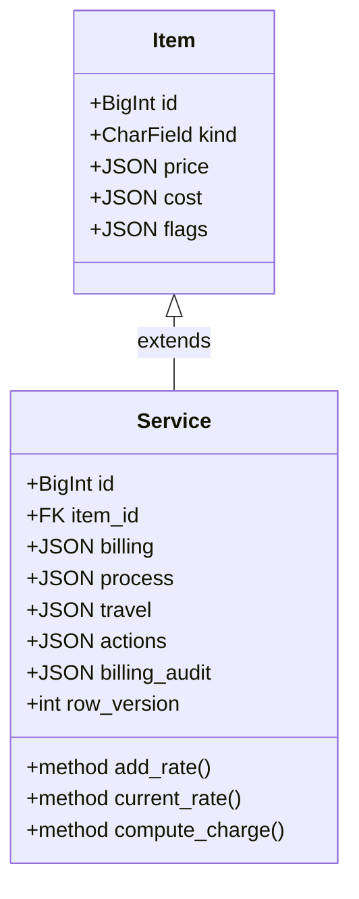
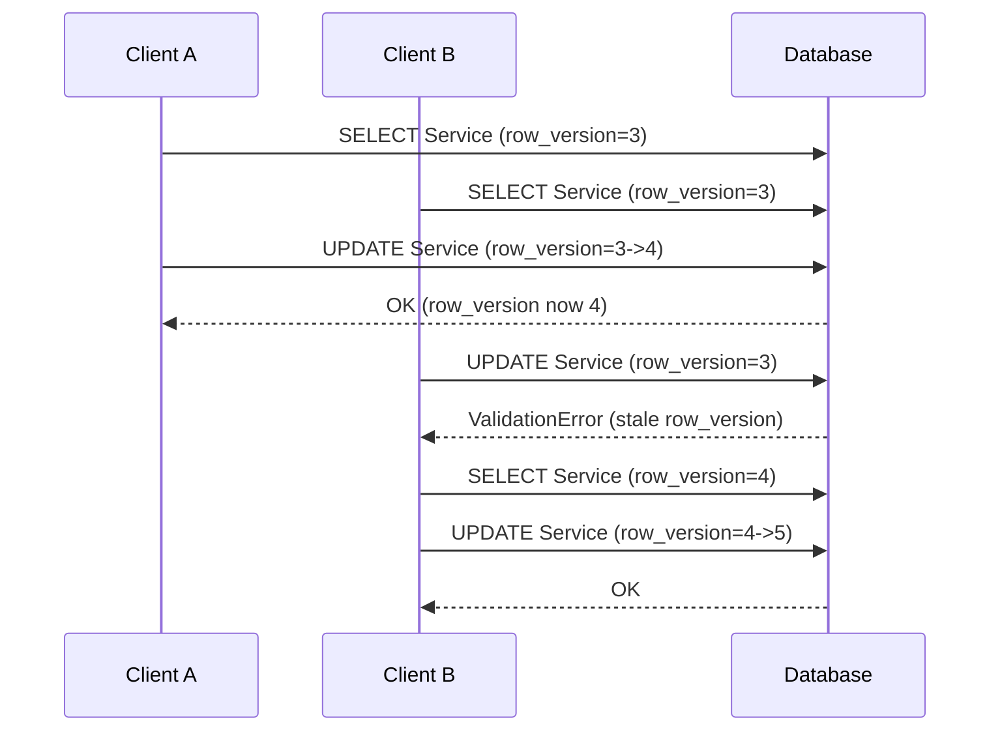
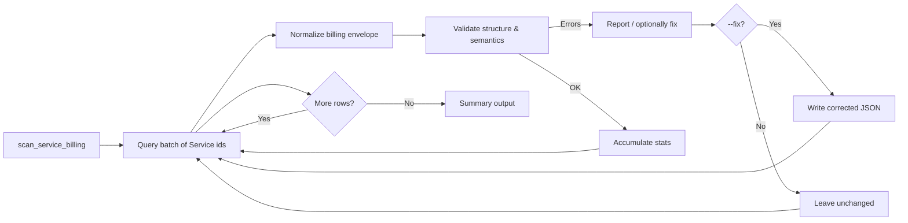

# Service Billing Guide

This guide explains how service billing works: schema, operations, validation, auditing, concurrency, and extension patterns.

---

## 1. Purpose

`Service.billing` is a versioned JSON envelope enabling:

* Tiered labor pricing
* Travel surcharges
* Rounding policies
* Min / max charge enforcement
* Change auditing
* Forward compatibility via `schema_version` + `extensions`

---

## 2. JSON Schemas

### Billing Envelope

```json
{
  "currency": "USD",
  "tiers": [
    {"unit": "hour", "rate": 150.0, "cost": 90.0, "min_minutes": 30, "dt_effective": 1736123456000}
  ],
  "travel": {"per_mile": 2.5, "per_hour": 0.0, "included_miles": 10, "dt_updated": 1736123000000},
  "rounding": {"strategy": "HALF_UP", "places": 2},
  "min_charge": null,
  "max_charge": null,
  "schema_version": 1,
  "version": 1,
  "extensions": {}
}
```

Key rules:

* Tiers strictly increase by `dt_effective`.
* Allowed units: `hour`, `minute`, `day`, `flat`.
* `min_minutes` floors billable time for that tier.
* Monetary numbers normalized internally to consistent precision.

### Process Envelope

| Key | Description |
|-----|-------------|
| `steps` | List of `{name, minutes}` — unique name (case-insensitive) |
| `dt_updated` | Epoch ms |
| `version` / `schema_version` | Integer |
| `extensions` | Reserved future structure |

### Travel Envelope

| Key | Description |
|-----|-------------|
| `miles_included` | Included miles before surcharge |
| `lodging_required` | Boolean |
| `meal_per_diem` | Decimal |
| `notes` | Free text |
| `dt_updated` | Epoch ms |
| `schema_version` / `extensions` | Standard envelope fields |

### Actions Envelope

| Key | Description |
|-----|-------------|
| `records` | List of action dicts created when service added to a transaction |
| `schema_version` / `extensions` | Standard envelope fields |

### Audit Log

`billing_audit`: append-only `[{dt, summary, row_version}]` capped to last 100 entries.

---

## 3. Core Operations

Add / update rate:

```python
svc.add_rate(rate=175, unit="hour", min_minutes=60, dt_effective=epoch_ms)
svc.save()
```

Get current rate:

```python
current = svc.current_rate("hour")
```

Compute charge:

```python
charge = svc.compute_charge(minutes=90, miles=40, unit="hour")
```

Charge algorithm steps:

1. Pick latest tier for unit.
2. Enforce `min_minutes`.
3. Base = time * rate (convert to hours if needed).
4. Travel surcharge = (max(0, miles - included_miles) * per_mile).
5. Apply rounding strategy.
6. Enforce min/max charge.

Edge cases: no tier → 0.0; negative inputs → `ValueError`.

---

## 4. Validation

On `clean()` / `save()`:

* Currency: 3 alpha chars.
* Chronological, unique `dt_effective`.
* Allowed units only.
* Non-negative numeric fields.
* Unique process step names (case-insensitive).
* Concurrency: `row_version` match required.

---

## 5. Concurrency (`row_version`)

* Starts at 0 on create.
* Incremented on each update save.
* Stale instance save → `ValidationError`.

---

## 6. Auditing

`billing_audit` keeps last 100 entries:

```json
{"dt": 1736123456000, "summary": "Added tier unit=hour rate=175", "row_version": 5}
```

---

## 7. Travel Pricing

Per-mile surcharge implemented; `per_hour` reserved. Extend via `travel` or `extensions` when adding new distance/time metrics.

---

## 8. Rounding

Current: `HALF_UP` (fallback uses Python `round`). Configure decimal places via `rounding.places` (default 2).

---

## 9. Min / Max Charge

`min_charge` floors; `max_charge` caps after rounding. Use for contract enforcement and small engagement viability.

---

## 10. Schema Evolution

Upgrade flow: implement transforms in `ensure_billing_schema()` and bump `schema_version`. Non-breaking additions go under `extensions`.

---

## 11. Management Command

```bash
python manage.py scan_service_billing --limit 200 --fix
```

Scans, normalizes, and optionally fixes invalid billing envelopes.

---

## 12. Testing

See `tests/test_service_billing.py` covering: rate add, rounding, travel, caps, currency validation, duplicate tier rejection, process uniqueness, concurrency.

---

## 13. Pitfalls

| Symptom | Cause | Fix |
|---------|-------|-----|
| Charge = 0 | No tier for unit | Add tier matching unit |
| Concurrency error | Stale `row_version` | Re-fetch & retry |
| Duplicate tier error | Same `dt_effective` | Adjust timestamp |
| Negative field error | Bad input | Sanitize before insert |
| Unexpected rounding | Strategy / places mismatch | Verify `rounding` keys |

---

## 14. Extending

Prefer `billing.extensions` for additive keys; update normalization & validation; add tests; bump `schema_version` only for breaking changes.

---

## 15. Legacy / Migration Notes

Legacy booleans moved to `Item.flags`. Plain text tax codes wrapped into JSON before column type change (see migration `0002_drop_legacy_cost_price_and_flags_json`). Follow same pattern for future primitive → JSON upgrades.

---

## 16. Example

```python
from apps.products.models.service import Service
from apps.products.models.item import Item

item = Item.objects.create(name="Install Labor", kind=Item.KIND_SERVICE)
svc = Service(item=item, description="Standard install")
svc.add_rate(rate=125, unit="hour", min_minutes=60, dt_effective=1736123000000)
svc.billing["travel"]["per_mile"] = 2.0
svc.billing["travel"]["included_miles"] = 15
svc.save()

charge = svc.compute_charge(minutes=90, miles=40)
print(charge)
```

---

## 17. Glossary

* Tier: Pricing record keyed by `dt_effective`.
* Effective Timestamp: Millisecond epoch controlling activation order.
* Min Billable Minutes: Floor for engagement billing.
* Rounding Strategy: Rule for precision of final charge.
* Travel Surcharge: Distance-based addition beyond included miles.

---

## 18. Future Ideas

* Usage / volume brackets.
* Regional multipliers.
* Drive time billing (`per_hour`).
* Materialized pricing snapshot.
* Multi-currency conversion layer.
* Consider separate ServiceRate table for heavy querying.
* Additional rounding strategies.

---

## 19. Support

Owner: Products Domain Team
Escalation: Create issue label `service-billing` with `Service.id` & billing JSON.

---

## 20. Diagrams

### 20.1 Charge Computation Flow

```mermaid
flowchart TD
  A[Input Request\nminutes, miles, unit] --> B[Normalize / validate inputs]
  B --> C[Select current tier for unit]
  C -->|No tier| R[Return 0.0]
  C -->|Tier found| D[Enforce min_minutes]
  D --> E[Convert time -> billable quantity]\n
  E --> F[Base = qty * rate]
  F --> G[Travel surcharge = max(0, miles - included) * per_mile]
  G --> H[Total = Base + Travel]
  H --> I[Apply rounding strategy]
  I --> J[Apply min_charge floor]
  J --> K[Apply max_charge cap]
  K --> L[Return final charge]
  R:::terminal
  L:::terminal

  classDef terminal fill=#0b7285,stroke=#09414e,color=#fff;
```

### 20.2 Data / Relationship Overview



### 20.3 Concurrency Save Sequence



### 20.4 Scan Command Lifecycle


