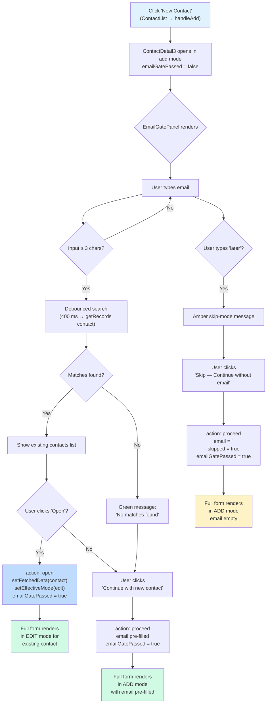
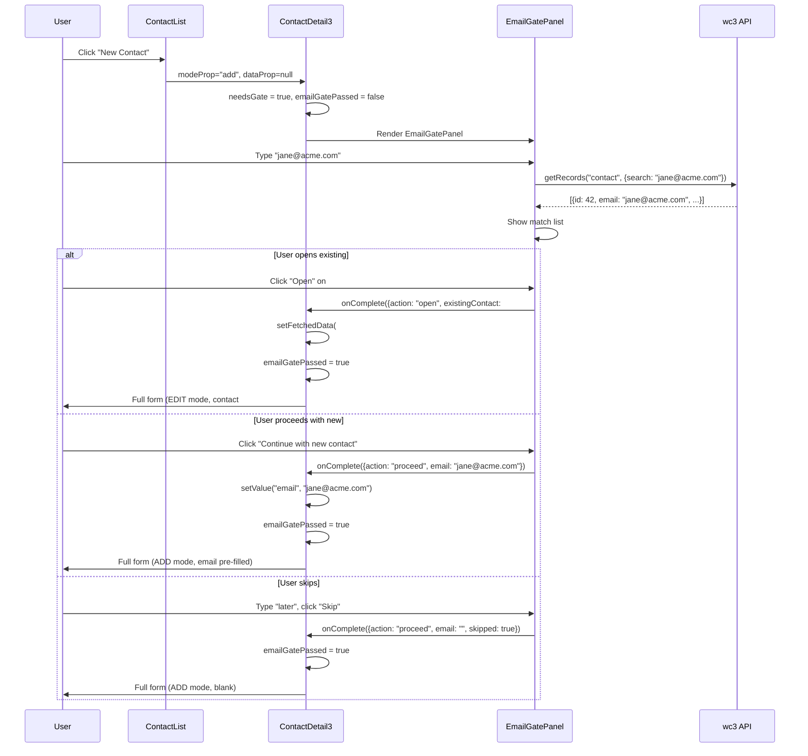

# Email Gate Flow — ContactDetail3

> Pre-entry validation that prevents duplicate contacts by requiring an email
> search before the full add-form is revealed.

---

## Overview

When creating a new contact, `ContactDetail3` inserts an **EmailGatePanel**
between the "New Contact" button click and the full form.  The gate ensures that
staff, admins, and reps search for an existing contact before entering data.
End-user self-registration (where the contact already has a confirmed ID) skips
the gate entirely.

---

## Flow Diagram (Staff / Admin / Rep)



---

## Key Files

| File | Role |
|------|------|
| `src/apps/common/components/panels/EmailGatePanel.tsx` | Standalone gate UI — input, search, results list, proceed/skip buttons |
| `src/apps/core/models/contact/pages/ContactDetail3.tsx` | Host page — owns gate state, renders the panel, handles completion callback |
| `src/apps/core/models/contact/pages/ContactList.tsx` | Entry point — `handleAdd()` sets `detailVariant(3)` so `New Contact` opens Detail3 |
| `src/apps/common/components/panels/index.ts` | Barrel export for `EmailGatePanel` and `EmailGateResult` |

---

## State Machine (ContactDetail3)

```
                          ┌──────────────────────┐
                          │   recordMode = "add"  │
                          │   dataProp.id = null   │
                          │   contactIdFromUrl = ∅ │
                          └──────────┬───────────┘
                                     │
                              needsGate = true
                              emailGatePassed = false
                                     │
                          ┌──────────▼───────────┐
                          │   EmailGatePanel UI   │
                          └──────────┬───────────┘
                                     │
               ┌─────────────────────┼─────────────────────┐
               ▼                     ▼                     ▼
        action: "open"        action: "proceed"     action: "proceed"
        (existingContact)     (email supplied)       (skipped = true)
               │                     │                     │
               ▼                     ▼                     ▼
        setFetchedData()      setValue("email")       email = ""
        setEffectiveMode      emailGatePassed         emailGatePassed
          → "edit"              → true                  → true
        emailGatePassed              │                     │
          → true                     ▼                     ▼
               │              Full form (ADD)        Full form (ADD)
               ▼              email pre-filled       email empty
        Full form (EDIT)
        existing contact
```

### Gate activation condition

```ts
const needsGate = recordMode === "add" && !dataProp?.id && !contactIdFromUrl;
```

The gate is **never shown** when:
- Viewing or editing an existing contact (`recordMode ≠ "add"`)
- The parent supplies a `dataProp` with an `id` (end-user self-registration)
- A `contactIdFromUrl` is present in the route

### Gate reset

Pressing **Cancel** while the gate is open resets `emailGatePassed = false` so
re-opening add-mode shows the gate again:

```ts
// Inside handleCancel
if (needsGate) setEmailGatePassed(false);
```

---

## EmailGatePanel — Component API

```ts
interface EmailGateResult {
  action: "proceed" | "open";
  email: string;
  existingContact?: any;   // present when action === "open"
  skipped: boolean;         // true when user typed "later"
}

interface EmailGatePanelProps {
  onComplete: (result: EmailGateResult) => void;
  onCancel?: () => void;
  isStaff?: boolean;        // affects UI messaging
}
```

### Search behaviour

| Trigger | Behaviour |
|---------|-----------|
| Input < 3 chars | No search; results cleared |
| Input ≥ 3 chars | Debounced 400 ms → `getRecords("contact", { search, q, limit: 10 })` |
| Input = `"later"` | No search; amber "skip mode" indicator shown |
| Enter key | If `"later"` → proceed. If ≥ 3 chars with 0 matches (after search) → proceed. |

### Result actions

| Action | What happens in ContactDetail3 |
|--------|-------------------------------|
| **Open existing** | `setFetchedData(contact)`, `setEffectiveMode("edit")` — form loads existing record |
| **Proceed (with email)** | `formSetValueRef.current("email", value)` — new form with email pre-filled |
| **Skip ("later")** | Form opens blank — user can add email manually later |

---

## Persona Handling

### Staff / Admin / Rep

- `isStaff` is derived from `authUser.is_staff`, `is_superuser`, or `role ∈ {admin, manager, staff}`.
- UI heading: **"New Contact — Enter Email First"**
- Hint text: *"Search for an existing contact before creating a new one. Type 'later' to skip."*
- Can bypass with `"later"` keyword.

### End-user (self-registration)

- The parent flow supplies a `dataProp` with an existing `id` (created during
  email confirmation), so `needsGate = false` and the gate never renders.
- If the gate *did* render for an end-user, the heading reads **"Enter Your Email"**
  and the hint reads *"We'll check if you already have an account."*

---

## Integration with ContactList

```ts
// ContactList.tsx — handleAdd
const handleAdd = () => {
  setSelectedContact(null);     // no existing data
  setFormMode("add");
  setDetailVariant(3);          // always opens Detail3
};
```

The variant-selector badges (`Detail`, `Detail 2`, `Detail 3`) remain visible
so the user can switch variants during view/edit, but **New Contact always
starts on Detail3** to benefit from the email gate.

---

## Sequence Diagram



---

## Design Decisions

1. **Gate renders as an interceptor, not a modal.** The entire Detail3 content
   area shows the gate. This prevents background form interactions and makes the
   flow feel like a proper step.

2. **Client-side debounce (400 ms).** Avoids hammering the API on every
   keystroke. The search icon becomes a spinner during the request.

3. **"later" is a keyword, not a button.** Keeps the primary UI path focused on
   email-first search while still providing an escape hatch that is discoverable
   via the hint text.

4. **`formSetValueRef` + `setTimeout`** for email pre-fill. The react-hook-form
   instance may not be fully mounted at the instant the gate completes, so a
   one-tick delay via `setTimeout(fn, 0)` ensures the ref is populated.

5. **`handleCancel` resets the gate** so that repeatedly clicking New Contact
   always shows the gate.

6. **`needsGate` is computed, not stored.** It derives from `recordMode`,
   `dataProp?.id`, and `contactIdFromUrl`, so it reacts naturally when any of
   those change.
