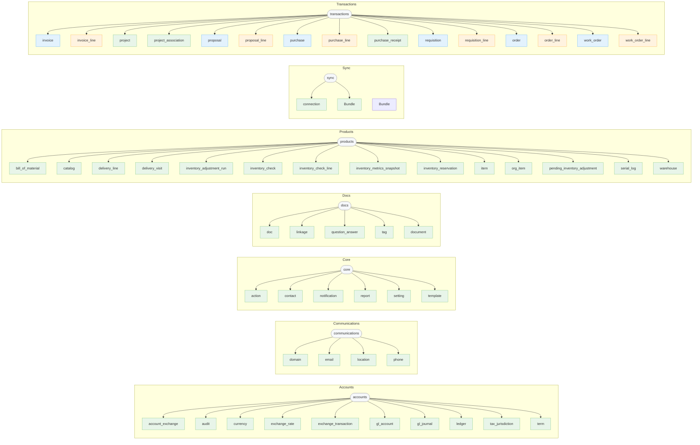

# Model Registry

> **Reading order**: [← 04-wcapi-usage](04-wcapi-usage.md) | [06-api-conventions →](06-api-conventions.md)

---

Autogenerated reference derived from the canonical MODEL_REGISTRY.
Do not edit by hand; run `bin/python Scripts/gen_model_registry_readme.py` to regenerate.

## Migration note

- Prefer `item` for product records. Use `model_name=item` (plural table key: `items`).
- `org_item` refers to the Org↔Item association (assortment/carry relationship), not the product itself.
- Existing clients that queried products with `org_item` should switch to `item` for product list/detail calls.
- `org_item` remains available for association use cases (org assortment, thresholds, checks).

## Alphabetical list (A→Z)

- account_exchange — app: `accounts`, endpoint: [`/wcapi/account-exchanges/`](/wcapi/account-exchanges/), kind: `support`, aliases: exchanges_account
- action — app: `core`, endpoint: [`/wcapi/actions/`](/wcapi/actions/), kind: `support`, aliases: actions
- audit — app: `accounts`, endpoint: [`/wcapi/audits/`](/wcapi/audits/), kind: `support`, aliases: audits
- bill_of_material — app: `products`, endpoint: [`/wcapi/bills-of-material/`](/wcapi/bills-of-material/), kind: `support`, aliases: bill_of_materials, bill_of_material
- catalog — app: `products`, endpoint: [`/wcapi/catalogs/`](/wcapi/catalogs/), kind: `support`, aliases: catalogs
- connection — app: `sync`, endpoint: [`/wcapi/connections/`](/wcapi/connections/), kind: `support`, aliases: connections
- contact — app: `core`, endpoint: [`/wcapi/contacts/`](/wcapi/contacts/), kind: `support`, aliases: contacts
- currency — app: `accounts`, endpoint: [`/wcapi/currencies/`](/wcapi/currencies/), kind: `support`, aliases: currencies
- delivery_line — app: `products`, endpoint: [`/wcapi/delivery-lines/`](/wcapi/delivery-lines/), kind: `support`, aliases: delivery_lines
- delivery_visit — app: `products`, endpoint: [`/wcapi/delivery-visits/`](/wcapi/delivery-visits/), kind: `support`, aliases: delivery_visits
- doc — app: `docs`, endpoint: [`/wcapi/docs/`](/wcapi/docs/), kind: `support`, aliases: docs, document, documents
- linkage — app: `docs`, endpoint: [`/wcapi/doc-linkages/`](/wcapi/doc-linkages/), kind: `support`, aliases: linkages
- question_answer — app: `docs`, endpoint: [`/wcapi/doc-qas/`](/wcapi/doc-qas/), kind: `support`, aliases: question_answer
- tag — app: `docs`, endpoint: [`/wcapi/doc-tags/`](/wcapi/doc-tags/), kind: `support`, aliases: tags
- document — app: `docs`, endpoint: [`/wcapi/documents/`](/wcapi/documents/), kind: `support`, aliases: doc, documents
- domain — app: `communications`, endpoint: [`/wcapi/domains/`](/wcapi/domains/), kind: `support`, aliases: domains
- email — app: `communications`, endpoint: [`/wcapi/emails/`](/wcapi/emails/), kind: `support`, aliases: emails
- exchange_rate — app: `accounts`, endpoint: [`/wcapi/exchange-rates/`](/wcapi/exchange-rates/), kind: `support`, aliases: exchange_rates
- exchange_transaction — app: `accounts`, endpoint: [`/wcapi/exchange-transactions/`](/wcapi/exchange-transactions/), kind: `support`, aliases: exchange_transactions
- gl_account — app: `accounts`, endpoint: [`/wcapi/gl-accounts/`](/wcapi/gl-accounts/), kind: `support`, aliases: gl_accounts
- gl_journal — app: `accounts`, endpoint: [`/wcapi/gl-journals/`](/wcapi/gl-journals/), kind: `support`, aliases: gl_journals
- inventory_adjustment_run — app: `products`, endpoint: [`/wcapi/inventory-adjustment-runs/`](/wcapi/inventory-adjustment-runs/), kind: `support`, aliases: inventory_adjustment_runs
- inventory_check — app: `products`, endpoint: [`/wcapi/inventory-checks/`](/wcapi/inventory-checks/), kind: `support`, aliases: inventory_checks
- inventory_check_line — app: `products`, endpoint: [`/wcapi/inventory-check-lines/`](/wcapi/inventory-check-lines/), kind: `support`, aliases: inventory_check_lines
- inventory_metrics_snapshot — app: `products`, endpoint: [`/wcapi/inventory-metrics-snapshots/`](/wcapi/inventory-metrics-snapshots/), kind: `support`, aliases: inventory_metrics_snapshots
- inventory_reservation — app: `products`, endpoint: [`/wcapi/inventory-reservations/`](/wcapi/inventory-reservations/), kind: `support`, aliases: inventory_reservations
- invoice — app: `transactions`, endpoint: [`/wcapi/invoices/`](/wcapi/invoices/), kind: `header`, aliases: invoices
- invoice_line — app: `transactions`, endpoint: [`/wcapi/invoice-lines/`](/wcapi/invoice-lines/), kind: `line`, aliases: invoice_lines
- item — app: `products`, endpoint: [`/wcapi/items/`](/wcapi/items/), kind: `support`, aliases: items
- ledger — app: `accounts`, endpoint: [`/wcapi/ledgers/`](/wcapi/ledgers/), kind: `support`, aliases: ledgers
- location — app: `communications`, endpoint: [`/wcapi/locations/`](/wcapi/locations/), kind: `support`, aliases: locations
- notification — app: `core`, endpoint: [`/wcapi/notifications/`](/wcapi/notifications/), kind: `support`, aliases: notifications
- org_item — app: `products`, endpoint: [`/wcapi/org-items/`](/wcapi/org-items/), kind: `support`, aliases: org_items
- pending_inventory_adjustment — app: `products`, endpoint: [`/wcapi/pending-inventory-adjustments/`](/wcapi/pending-inventory-adjustments/), kind: `support`, aliases: pending_inventory_adjustments
- phone — app: `communications`, endpoint: [`/wcapi/phones/`](/wcapi/phones/), kind: `support`, aliases: phones
- project — app: `transactions`, endpoint: [`/wcapi/projects/`](/wcapi/projects/), kind: `support`, aliases: projects
- project_association — app: `transactions`, endpoint: [`/wcapi/project-associations/`](/wcapi/project-associations/), kind: `support`, aliases: project_associations
- proposal — app: `transactions`, endpoint: [`/wcapi/proposals/`](/wcapi/proposals/), kind: `header`, aliases: proposals
- proposal_line — app: `transactions`, endpoint: [`/wcapi/proposal-lines/`](/wcapi/proposal-lines/), kind: `line`, aliases: proposal_lines
- purchase — app: `transactions`, endpoint: [`/wcapi/purchase-orders/`](/wcapi/purchase-orders/), kind: `header`, aliases: purchases
- purchase_line — app: `transactions`, endpoint: [`/wcapi/purchase-order-lines/`](/wcapi/purchase-order-lines/), kind: `line`, aliases: purchase_lines
- purchase_receipt — app: `transactions`, endpoint: [`/wcapi/purchase-receipts/`](/wcapi/purchase-receipts/), kind: `support`, aliases: purchase_receipts
- report — app: `core`, endpoint: [`/wcapi/reports/`](/wcapi/reports/), kind: `support`, aliases: reports
- requisition — app: `transactions`, endpoint: [`/wcapi/requisitions/`](/wcapi/requisitions/), kind: `header`, aliases: requisitions
- requisition_line — app: `transactions`, endpoint: [`/wcapi/requisition-lines/`](/wcapi/requisition-lines/), kind: `line`, aliases: requisition_lines
- order — app: `transactions`, endpoint: [`/wcapi/orders/`](/wcapi/orders/), kind: `header`, aliases: orders
- order_line — app: `transactions`, endpoint: [`/wcapi/order-lines/`](/wcapi/order-lines/), kind: `line`, aliases: order_lines
- serial_log — app: `products`, endpoint: [`/wcapi/serial-logs/`](/wcapi/serial-logs/), kind: `support`, aliases: serial_logs
- setting — app: `core`, endpoint: [`/wcapi/settings/`](/wcapi/settings/), kind: `support`, aliases: settings
- Bundle — app: `sync`, endpoint: [`/wcapi/sync-exchanges/`](/wcapi/sync-exchanges/), kind: `support`, aliases: exchanges_sync
- tax_jurisdiction — app: `accounts`, endpoint: [`/wcapi/tax-jurisdictions/`](/wcapi/tax-jurisdictions/), kind: `support`, aliases: tax_jurisdictions
- template — app: `core`, endpoint: [`/wcapi/templates/`](/wcapi/templates/), kind: `support`, aliases: templates
- term — app: `accounts`, endpoint: [`/wcapi/terms/`](/wcapi/terms/), kind: `support`, aliases: terms
- warehouse — app: `products`, endpoint: [`/wcapi/warehouses/`](/wcapi/warehouses/), kind: `support`, aliases: warehouses
- work_order — app: `transactions`, endpoint: [`/wcapi/work-orders/`](/wcapi/work-orders/), kind: `header`, aliases: work_orders
- work_order_line — app: `transactions`, endpoint: [`/wcapi/workorder-lines/`](/wcapi/workorder-lines/), kind: `line`, aliases: work_order_lines

## By app (A→Z)

### accounts (10)

- account_exchange — endpoint: [`/wcapi/account-exchanges/`](/wcapi/account-exchanges/), kind: `support`, aliases: exchanges_account
- audit — endpoint: [`/wcapi/audits/`](/wcapi/audits/), kind: `support`, aliases: audits
- currency — endpoint: [`/wcapi/currencies/`](/wcapi/currencies/), kind: `support`, aliases: currencies
- exchange_rate — endpoint: [`/wcapi/exchange-rates/`](/wcapi/exchange-rates/), kind: `support`, aliases: exchange_rates
- exchange_transaction — endpoint: [`/wcapi/exchange-transactions/`](/wcapi/exchange-transactions/), kind: `support`, aliases: exchange_transactions
- gl_account — endpoint: [`/wcapi/gl-accounts/`](/wcapi/gl-accounts/), kind: `support`, aliases: gl_accounts
- gl_journal — endpoint: [`/wcapi/gl-journals/`](/wcapi/gl-journals/), kind: `support`, aliases: gl_journals
- ledger — endpoint: [`/wcapi/ledgers/`](/wcapi/ledgers/), kind: `support`, aliases: ledgers
- tax_jurisdiction — endpoint: [`/wcapi/tax-jurisdictions/`](/wcapi/tax-jurisdictions/), kind: `support`, aliases: tax_jurisdictions
- term — endpoint: [`/wcapi/terms/`](/wcapi/terms/), kind: `support`, aliases: terms

### communications (4)

- domain — endpoint: [`/wcapi/domains/`](/wcapi/domains/), kind: `support`, aliases: domains
- email — endpoint: [`/wcapi/emails/`](/wcapi/emails/), kind: `support`, aliases: emails
- location — endpoint: [`/wcapi/locations/`](/wcapi/locations/), kind: `support`, aliases: locations
- phone — endpoint: [`/wcapi/phones/`](/wcapi/phones/), kind: `support`, aliases: phones

### core (6)

- action — endpoint: [`/wcapi/actions/`](/wcapi/actions/), kind: `support`, aliases: actions
- contact — endpoint: [`/wcapi/contacts/`](/wcapi/contacts/), kind: `support`, aliases: contacts
- notification — endpoint: [`/wcapi/notifications/`](/wcapi/notifications/), kind: `support`, aliases: notifications
- report — endpoint: [`/wcapi/reports/`](/wcapi/reports/), kind: `support`, aliases: reports
- setting — endpoint: [`/wcapi/settings/`](/wcapi/settings/), kind: `support`, aliases: settings
- template — endpoint: [`/wcapi/templates/`](/wcapi/templates/), kind: `support`, aliases: templates

### docs (5)

- doc — endpoint: [`/wcapi/docs/`](/wcapi/docs/), kind: `support`, aliases: docs, document, documents
- linkage — endpoint: [`/wcapi/doc-linkages/`](/wcapi/doc-linkages/), kind: `support`, aliases: linkages
- question_answer — endpoint: [`/wcapi/doc-qas/`](/wcapi/doc-qas/), kind: `support`, aliases: question_answer
- tag — endpoint: [`/wcapi/doc-tags/`](/wcapi/doc-tags/), kind: `support`, aliases: tags
- document — endpoint: [`/wcapi/documents/`](/wcapi/documents/), kind: `support`, aliases: doc, documents

### products (14)

- bill_of_material — endpoint: [`/wcapi/bills-of-material/`](/wcapi/bills-of-material/), kind: `support`, aliases: bill_of_materials, bill_of_material
- catalog — endpoint: [`/wcapi/catalogs/`](/wcapi/catalogs/), kind: `support`, aliases: catalogs
- delivery_line — endpoint: [`/wcapi/delivery-lines/`](/wcapi/delivery-lines/), kind: `support`, aliases: delivery_lines
- delivery_visit — endpoint: [`/wcapi/delivery-visits/`](/wcapi/delivery-visits/), kind: `support`, aliases: delivery_visits
- inventory_adjustment_run — endpoint: [`/wcapi/inventory-adjustment-runs/`](/wcapi/inventory-adjustment-runs/), kind: `support`, aliases: inventory_adjustment_runs
- inventory_check — endpoint: [`/wcapi/inventory-checks/`](/wcapi/inventory-checks/), kind: `support`, aliases: inventory_checks
- inventory_check_line — endpoint: [`/wcapi/inventory-check-lines/`](/wcapi/inventory-check-lines/), kind: `support`, aliases: inventory_check_lines
- inventory_metrics_snapshot — endpoint: [`/wcapi/inventory-metrics-snapshots/`](/wcapi/inventory-metrics-snapshots/), kind: `support`, aliases: inventory_metrics_snapshots
- inventory_reservation — endpoint: [`/wcapi/inventory-reservations/`](/wcapi/inventory-reservations/), kind: `support`, aliases: inventory_reservations
- item — endpoint: [`/wcapi/items/`](/wcapi/items/), kind: `support`, aliases: items
- org_item — endpoint: [`/wcapi/org-items/`](/wcapi/org-items/), kind: `support`, aliases: org_items
- pending_inventory_adjustment — endpoint: [`/wcapi/pending-inventory-adjustments/`](/wcapi/pending-inventory-adjustments/), kind: `support`, aliases: pending_inventory_adjustments
- serial_log — endpoint: [`/wcapi/serial-logs/`](/wcapi/serial-logs/), kind: `support`, aliases: serial_logs
- warehouse — endpoint: [`/wcapi/warehouses/`](/wcapi/warehouses/), kind: `support`, aliases: warehouses

### sync (2)

- connection — endpoint: [`/wcapi/connections/`](/wcapi/connections/), kind: `support`, aliases: connections
- bundle — endpoint: [`/wcapi/sync-exchanges/`](/wcapi/sync-exchanges/), kind: `support`, aliases: exchanges_sync

### transactions (15)

- invoice — endpoint: [`/wcapi/invoices/`](/wcapi/invoices/), kind: `header`, aliases: invoices
- invoice_line — endpoint: [`/wcapi/invoice-lines/`](/wcapi/invoice-lines/), kind: `line`, aliases: invoice_lines
- project — endpoint: [`/wcapi/projects/`](/wcapi/projects/), kind: `support`, aliases: projects
- project_association — endpoint: [`/wcapi/project-associations/`](/wcapi/project-associations/), kind: `support`, aliases: project_associations
- proposal — endpoint: [`/wcapi/proposals/`](/wcapi/proposals/), kind: `header`, aliases: proposals
- proposal_line — endpoint: [`/wcapi/proposal-lines/`](/wcapi/proposal-lines/), kind: `line`, aliases: proposal_lines
- purchase — endpoint: [`/wcapi/purchase-orders/`](/wcapi/purchase-orders/), kind: `header`, aliases: purchases
- purchase_line — endpoint: [`/wcapi/purchase-order-lines/`](/wcapi/purchase-order-lines/), kind: `line`, aliases: purchase_lines
- purchase_receipt — endpoint: [`/wcapi/purchase-receipts/`](/wcapi/purchase-receipts/), kind: `support`, aliases: purchase_receipts
- requisition — endpoint: [`/wcapi/requisitions/`](/wcapi/requisitions/), kind: `header`, aliases: requisitions
- requisition_line — endpoint: [`/wcapi/requisition-lines/`](/wcapi/requisition-lines/), kind: `line`, aliases: requisition_lines
- order — endpoint: [`/wcapi/orders/`](/wcapi/orders/), kind: `header`, aliases: orders
- order_line — endpoint: [`/wcapi/order-lines/`](/wcapi/order-lines/), kind: `line`, aliases: order_lines
- work_order — endpoint: [`/wcapi/work-orders/`](/wcapi/work-orders/), kind: `header`, aliases: work_orders
- work_order_line — endpoint: [`/wcapi/workorder-lines/`](/wcapi/workorder-lines/), kind: `line`, aliases: work_order_lines

## Diagram

Legend:
- header: blue nodes (document headers like orders)
- line: orange nodes (line items)
- support: green nodes (supporting/reference data)

> Source of truth: `apps/core/constants/model_registry.py`.