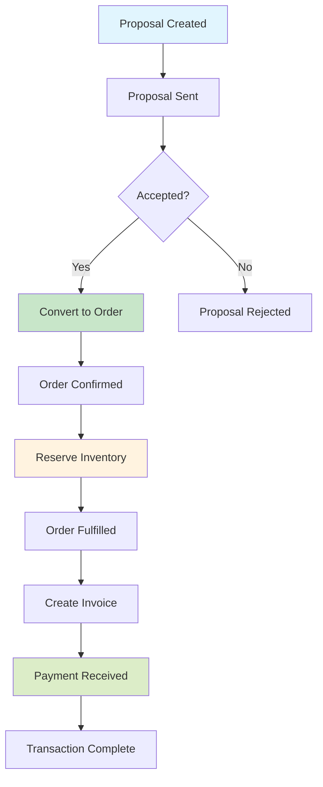

# React2025 Integration Guide for WebClerk3 Transaction Models

> **Reading order**: [← 06-api-conventions](06-api-conventions.md) | **End of core sequence**

---

## Overview

This guide outlines the integration of React2025 components for WebClerk3's transaction models, focusing on WC_Core.4dm features: basic order management, payments, reservations, and proposals. The components expand on traditional transaction processing with modern features including real-time calculations, multi-currency support, audit trails, and seamless API interactions.

## Scope

### Transaction Models

- **Proposals**: `proposal` and `proposal_line` models
- **Orders**: `sales_order` and `sales_order_line` models (basic order management)
- **Payments**: `payment` and `payment_application` models
- **Reservations**: `inventory_reservation` model (from products app)

### Key Features

- Real-time calculations with automatic totals computation
- Multi-currency support with exchange rate handling
- Comprehensive audit trails for all transactions
- WCAPI endpoint integration for CRUD operations
- Modern React patterns with hooks, context, and state management

## Component Architecture

### Directory Structure

```
src/components/transactions/
├── common/
│   ├── TransactionHeader.tsx
│   ├── TransactionLines.tsx
│   ├── TransactionTotals.tsx
│   ├── AuditTrail.tsx
│   └── CurrencyConverter.tsx
├── proposals/
│   ├── ProposalForm.tsx
│   ├── ProposalList.tsx
│   ├── ProposalDetail.tsx
│   └── ProposalConverter.tsx
├── orders/
│   ├── OrderForm.tsx
│   ├── OrderList.tsx
│   ├── OrderDetail.tsx
│   └── OrderStatusTracker.tsx
├── payments/
│   ├── PaymentForm.tsx
│   ├── PaymentList.tsx
│   ├── PaymentProcessor.tsx
│   └── PaymentHistory.tsx
├── reservations/
│   ├── ReservationForm.tsx
│   ├── ReservationList.tsx
│   └── ReservationManager.tsx
└── hooks/
    ├── useTransaction.ts
    ├── useWCAPI.ts
    ├── useRealTimeCalculations.ts
    └── useAuditTrail.ts
```

### Shared Components

#### TransactionHeader
- Displays transaction metadata (ID, status, dates, customer/vendor info)
- Status management with workflow transitions
- Customer/vendor selection with search

#### TransactionLines
- Dynamic line item management
- Inline editing with real-time validation
- Quantity, price, discount, and extended price calculations
- Item selection with inventory checking

#### TransactionTotals
- Automatic calculation of subtotals, taxes, shipping, discounts
- Real-time updates as line items change
- Multi-currency display with conversion rates

#### AuditTrail
- Complete transaction history
- User actions, timestamps, and changes
- Export capabilities for compliance

#### CurrencyConverter
- Real-time exchange rate fetching
- Currency selection and conversion
- Historical rate support for past transactions

## API Integration

### WCAPI Endpoints

All components use WCAPI endpoints for data operations:

```typescript
// Base WCAPI client
const wcapi = {
  get: (model: string, params?: any) =>
    fetch(`/wcapi/get/?model_name=${model}&${new URLSearchParams(params)}`),

  create: (model: string, data: any) =>
    fetch(`/wcapi/create/?model_name=${model}`, {
      method: 'POST',
      headers: { 'Content-Type': 'application/json' },
      body: JSON.stringify(data)
    }),

  update: (model: string, id: number, data: any) =>
    fetch(`/wcapi/update/?model_name=${model}&id=${id}`, {
      method: 'PUT',
      headers: { 'Content-Type': 'application/json' },
      body: JSON.stringify(data)
    }),

  delete: (model: string, id: number) =>
    fetch(`/wcapi/delete/?model_name=${model}&id=${id}`, {
      method: 'DELETE'
    })
};
```

### Dedicated Transaction APIs

For complex operations, use dedicated REST endpoints:

- Proposals: `/api/transactions/proposals/`
- Orders: `/api/transactions/sales-orders/`
- Payments: `/api/transactions/payments/`
- Reservations: `/api/products/inventory-reservations/`

## Modern Features Implementation

### Real-Time Calculations

```typescript
// Hook for real-time totals calculation
const useRealTimeCalculations = (lines: TransactionLine[]) => {
  const [totals, setTotals] = useState(defaultTotals);

  useEffect(() => {
    const calculateTotals = async () => {
      const subtotal = lines.reduce((sum, line) =>
        sum + (line.quantity * line.price), 0);

      const taxRate = await fetchTaxRate();
      const tax = subtotal * taxRate;

      const shipping = await calculateShipping(lines);
      const discount = calculateDiscount(lines);

      setTotals({
        subtotal,
        tax,
        shipping,
        discount,
        total: subtotal + tax + shipping - discount
      });
    };

    calculateTotals();
  }, [lines]);

  return totals;
};
```

### Multi-Currency Support

```typescript
// Currency conversion hook
const useCurrencyConverter = (baseCurrency: string) => {
  const [rates, setRates] = useState({});

  useEffect(() => {
    fetchExchangeRates(baseCurrency).then(setRates);
  }, [baseCurrency]);

  const convert = (amount: number, from: string, to: string) => {
    if (from === to) return amount;
    const rate = rates[to] / rates[from];
    return amount * rate;
  };

  return { convert, rates };
};
```

### Audit Trail

```typescript
// Audit trail hook
const useAuditTrail = (transactionId: number, model: string) => {
  const [trail, setTrail] = useState([]);

  useEffect(() => {
    fetchAuditTrail(transactionId, model).then(setTrail);
  }, [transactionId, model]);

  const addEntry = async (action: string, details: any) => {
    const entry = await createAuditEntry({
      transaction_id: transactionId,
      model,
      action,
      details,
      user_id: currentUser.id,
      timestamp: new Date()
    });

    setTrail(prev => [...prev, entry]);
  };

  return { trail, addEntry };
};
```

## Component Implementation Details

### Proposal Management

#### ProposalForm
- Create/edit proposals with line items
- Customer selection and contact info
- Automatic proposal numbering
- Status workflow: planned → sent → accepted/rejected

#### ProposalConverter
- Convert accepted proposals to sales orders
- Transfer line items with quantity adjustments
- Preserve pricing and discount information

### Order Management

#### OrderForm
- Create orders from proposals or directly
- Customer/vendor relationship management
- Shipping address and delivery scheduling
- Inventory reservation on order creation

#### OrderStatusTracker
- Visual status progression
- Automated status updates based on fulfillment
- Notification triggers for status changes

### Payment Processing

#### PaymentProcessor
- Integration with payment gateways (Stripe, PayPal)
- Multi-currency payment support
- Payment application to invoices/orders
- Reconciliation and refund handling

#### PaymentHistory
- Complete payment timeline
- Transaction reconciliation status
- Export for accounting systems

### Reservation Management

#### ReservationManager
- Real-time inventory availability checking
- Reservation creation with TTL (time-to-live)
- Automatic expiration handling
- Reservation conflicts resolution

## State Management

### Redux Structure

```javascript
// src/store/transactions/
├── proposalSlice.js
├── orderSlice.js
├── paymentSlice.js
├── reservationSlice.js
└── transactionSlice.js
```

### Context Providers

```typescript
// TransactionContext for shared state
const TransactionProvider = ({ children }) => {
  const [currentTransaction, setCurrentTransaction] = useState(null);
  const [calculations, setCalculations] = useState({});

  return (
    <TransactionContext.Provider value={{
      currentTransaction,
      setCurrentTransaction,
      calculations,
      setCalculations
    }}>
      {children}
    </TransactionContext.Provider>
  );
};
```

## Workflow Integration

### Transaction Flow Visualization



### Status Transitions

- **Proposals**: planned → sent → accepted → converted | rejected | canceled
- **Orders**: confirmed → released → in_progress → fulfilled | canceled
- **Payments**: pending → processing → completed | failed | refunded
- **Reservations**: pending → active → fulfilled | expired | canceled

## Testing Strategy

### Unit Tests
- Component rendering and interactions
- Hook functionality (calculations, API calls)
- Form validation and submission

### Integration Tests
- Complete transaction workflows
- API endpoint interactions
- State management across components

### E2E Tests
- Full user journeys (proposal → order → payment)
- Cross-component interactions
- Performance under load

## Performance Optimizations

### Code Splitting
```typescript
const ProposalForm = lazy(() => import('./proposals/ProposalForm'));
const OrderDetail = lazy(() => import('./orders/OrderDetail'));
```

### Memoization
```typescript
const TransactionTotals = memo(({ lines, taxRate }) => {
  // Expensive calculations
  return <div>{/* totals display */}</div>;
});
```

### API Caching
```typescript
const useWCAPICache = (model: string, params: any) => {
  return useQuery([model, params], () => wcapi.get(model, params), {
    staleTime: 5 * 60 * 1000, // 5 minutes
    cacheTime: 10 * 60 * 1000 // 10 minutes
  });
};
```

## Deployment and Integration

### Build Configuration
- Webpack/React setup for component library
- TypeScript for type safety
- ESLint/Prettier for code quality

### WebClerk3 Integration
- Import components into main React2025 application
- Route configuration for transaction pages
- Authentication and permission handling

### Monitoring
- Error tracking with Sentry
- Performance monitoring with application insights
- API usage analytics

## Future Enhancements

- Advanced reporting and analytics
- Mobile-responsive design improvements
- Integration with external ERP systems
- Machine learning for pricing optimization
- Blockchain-based audit trails for high-security transactions

## Conclusion

This integration provides a modern, feature-rich transaction management system built on React2025, seamlessly integrated with WebClerk3's WCAPI. The components maintain data integrity while providing an excellent user experience with real-time features and comprehensive audit capabilities.