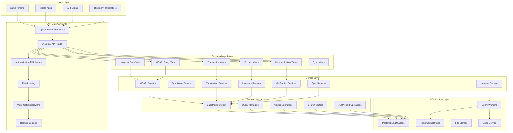
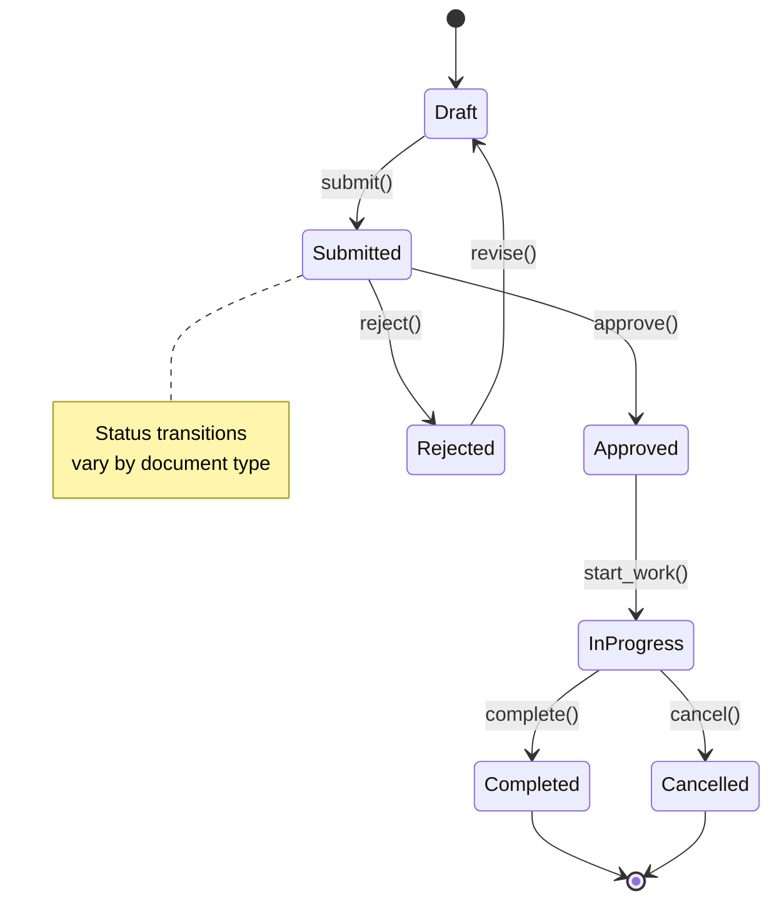
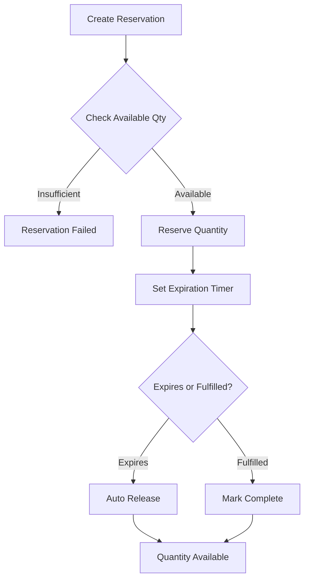
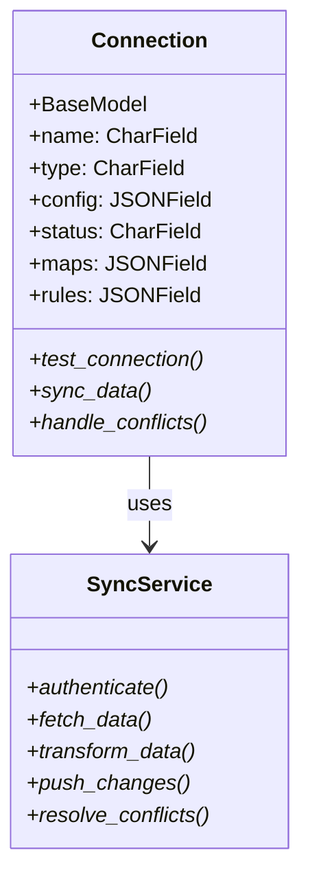
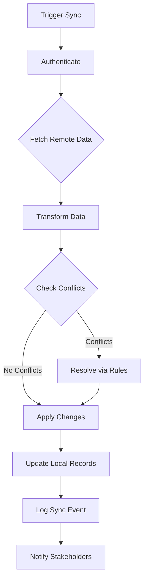
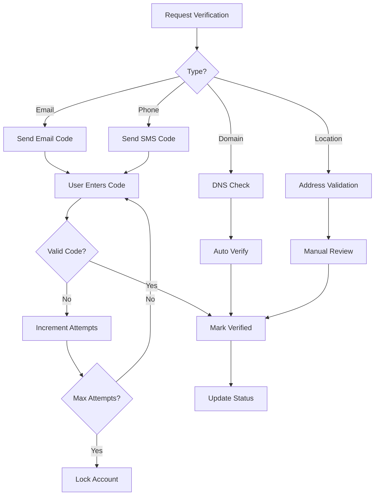
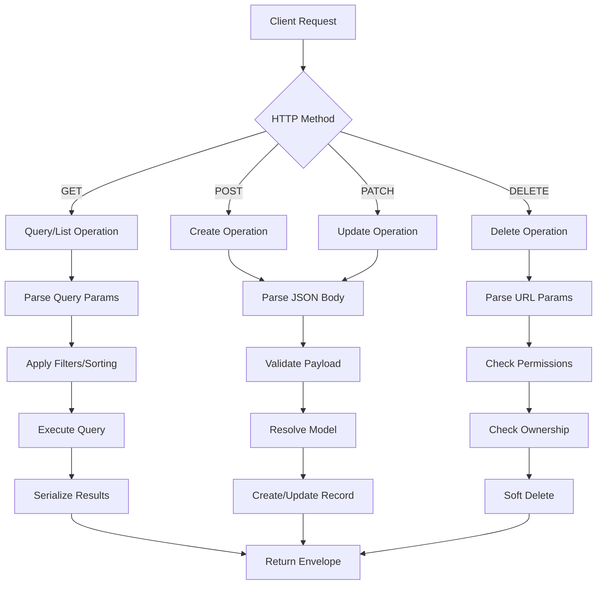
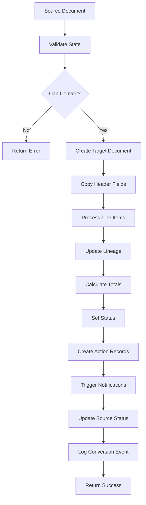
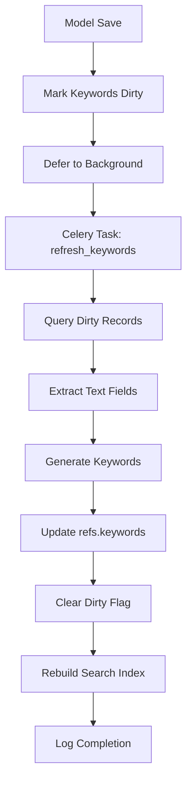
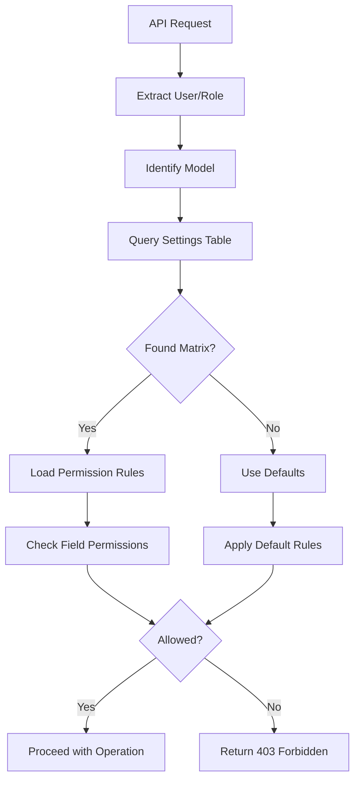

# WebClerk3 Components & Workflows

## Core Components Architecture



## Universal API Component Details

### WCAPI Registry (`apps/core/services/wcapi_registry.py`)
```python
# Key responsibilities:
# - Model allow-list management
# - Key normalization (plural -> singular)
# - Model resolution by string key
# - Registry introspection

MODEL_MAP = {
    'contact': Contact,
    'action': Action,
    'email': Email,
    'phone': Phone,
    'location': Location,
    'document': Document,
    # ... transaction models
    'proposal': Proposal,
    'order': Order,
    'invoice': Invoice,
    # ... etc
}
```

### Save View (`apps/core/views/save_view.py`)
**Responsibilities:**
- JSON payload parsing and validation
- Model resolution via registry
- Field size enforcement
- Deep merge of JSON fields (refs, prefs, metadata)
- Optimistic concurrency with version checking
- Pre/post save hooks
- Async task dispatching (keywords, sync)

**Key Features:**
- Supports both create and update operations
- Unknown fields captured in `prefs.userdefined`
- Password hashing for user models
- Comprehensive error handling with structured responses

### Query View (`apps/core/views/wcapi.py`)
**Responsibilities:**
- Safe filtering with allow-list
- Field projection
- Pagination
- Sorting
- Strict mode for unknown filters

**Safe Filter Fields:**
```python
SAFE_FILTER_FIELDS = {
    'email', 'name_first', 'name_last', 'company',
    'action', 'status', 'contact_id', 'created_by_id'
}
```

## Transaction System Components

### Transaction Base Classes
```mermaid
classDiagram
    class TransactionBaseModel {
        +BaseModel
        +contact_id: IntegerField
        +status: CharField
        +currency: CharField
        +totals: JSONField
        +due_date: DateTimeField
        +compute_totals()*
        +validate_flow()*
    }

    class TransactionLineBaseModel {
        +BaseModel
        +parent_id: IntegerField
        +item_id: IntegerField
        +quantity: DecimalField
        +price_unit: DecimalField
        +cost_unit: DecimalField
        +status: CharField
        +inherit_from_parent()*
        +update_lineage()*
    }

    TransactionBaseModel ||--o{ TransactionLineBaseModel : contains
```

### Transaction Flow Engine
**Key Components:**
- **Flow Conversion Services** (`apps/transactions/services/`)
  - `order_to_invoice.py`: Order → Invoice conversion
  - `purchase_to_order.py`: Purchase Requisition → Purchase Order
  - `transfer_utils.py`: Cross-document data transfer

- **Aggregation Services**
  - `invoice_totals.py`: Invoice sell/cost calculations
  - `po_totals.py`: Purchase order totals
  - `wo_totals.py`: Work order totals

- **Validation Services**
  - Flow state validation
  - Business rule enforcement
  - Lineage consistency checks

### Transaction Workflow States


## Inventory Management Components

### Inventory Layer System
```mermaid
classDiagram
    class InventoryLayer {
        +CoreModel
        +item_id: IntegerField
        +location_id: IntegerField
        +quantity: DecimalField
        +cost_avg: DecimalField
        +reservations: JSONField
        +adjust_quantity()*
        +reserve_quantity()*
        +release_reservation()*
    }

    class InventoryReservation {
        +CoreModel
        +inventory_layer_id: IntegerField
        +contact_id: IntegerField
        +quantity: DecimalField
        +purpose: CharField
        +expires_at: DateTimeField
        +fulfill()*
        +expire()*
    }

    InventoryLayer ||--o{ InventoryReservation : has
```

### Reservation Workflow


## Synchronization Components

### Connection Framework


### Sync Workflow


## Communication Components

### Verification System


## Key Workflows

### 1. Universal CRUD Workflow


### 2. Transaction Conversion Workflow


### 3. Keyword Refresh Pipeline


### 4. Permission Resolution Workflow


## Service Layer Components

### Core Services
- **WCAPI Registry**: Model discovery and allow-listing
- **Permission Service**: Field-level access control
- **Keyword Service**: Text extraction and indexing
- **Validation Service**: Business rule enforcement

### Domain Services
- **Transaction Services**: Flow conversions, totals calculation
- **Inventory Services**: Quantity tracking, reservations
- **Communication Services**: Verification, notifications
- **Sync Services**: External system integration

### Infrastructure Services
- **Cache Service**: Redis operations for performance
- **Queue Service**: Celery task management
- **Storage Service**: File upload/download handling
- **Notification Service**: Email/SMS delivery

## Error Handling & Resilience

### Error Response Envelope
```json
{
  "status": "error",
  "error": {
    "code": "validation_error",
    "details": "Field validation failed",
    "field_errors": {
      "email": ["Invalid format"],
      "quantity": ["Must be positive"]
    }
  },
  "meta": {
    "request_id": "abc-123",
    "timestamp": 1730937600000
  }
}
```

### Circuit Breaker Pattern
- Automatic failure detection for external services
- Graceful degradation when dependencies unavailable
- Retry logic with exponential backoff
- Fallback responses for critical operations

### Monitoring & Observability
- Structured logging with correlation IDs
- Metrics collection (request counts, durations, errors)
- Health checks for all major components
- Alerting on service degradation

This component and workflow documentation provides a detailed view of WebClerk3's architecture, showing how the various pieces work together to deliver a cohesive business application platform.