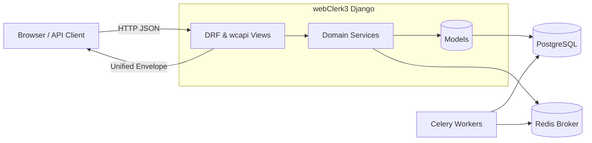
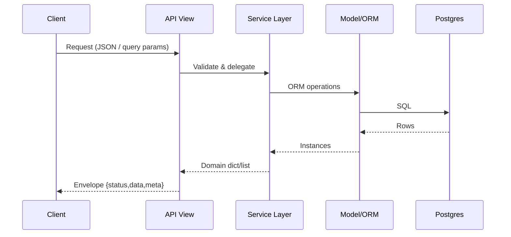

<!-- Replaced placeholder with authoritative content from README_s/data-map.md -->

# Data / Model Structure Map

Date: 2025-09-03
Review: 2025-12-15
Status: -- status --
Owner: Bill

Central reference for high-level architecture diagrams, model inventory, and key cross-cutting data flows. Generated sections are delimited by markers so the `generate_data_map` management command can refresh them safely.

## System Architecture (High Level)



## Universal API Concept

Single pattern (`/wcapi/get|save|query|manage`) abstracts CRUD-ish operations across multiple tables using a normalized request schema and unified response envelope (see `envelope.md`). Specialized endpoints (e.g. BOM API) follow DRF viewset / APIView conventions but still emit the envelope.

## Key Data Flows



## Auto‑Generated Model Inventory

The section below is programmatically regenerated. Do **not** hand edit between markers.

<!-- AUTO:MODEL_MAP:START -->
<!-- (Run `python manage.py generate_data_map` to populate on first commit after adding this file.) -->
<!-- AUTO:MODEL_MAP:END -->

## Regeneration

```bash
python manage.py generate_data_map        # rewrites model table in-place
python manage.py generate_data_map --stdout  # preview only
```

## Future Enhancements

- Endpoint catalog (derive from `urls.py` graph).
- Field change drift detector (warn when model signature changes without regeneration).
- Relationship graph (mermaid) auto-generated from FK/M2M introspection.

---

_Migrated from legacy `MAP.md` on 2025‑09‑01 and expanded with diagrams + automation markers on 2025‑09‑02._
