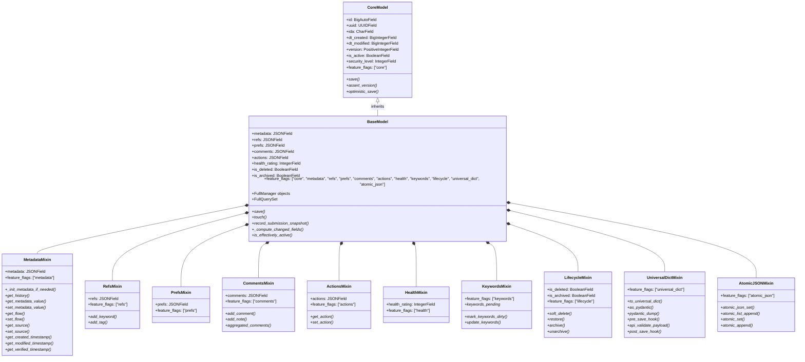
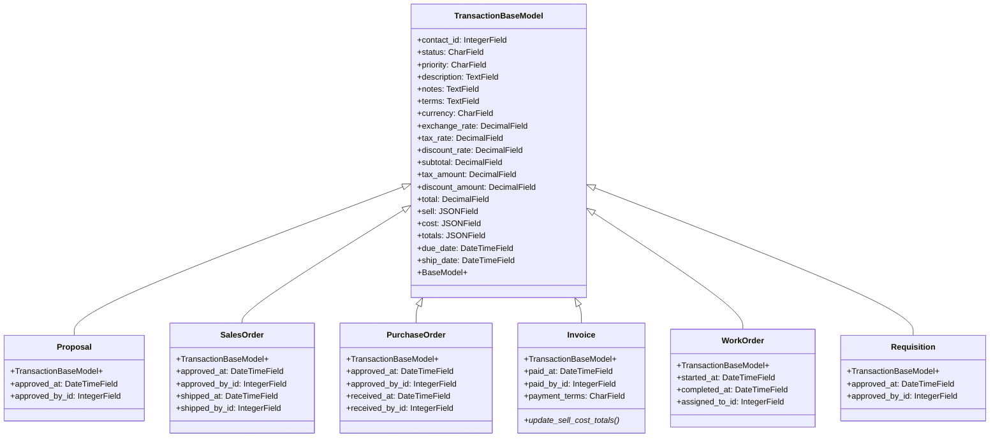
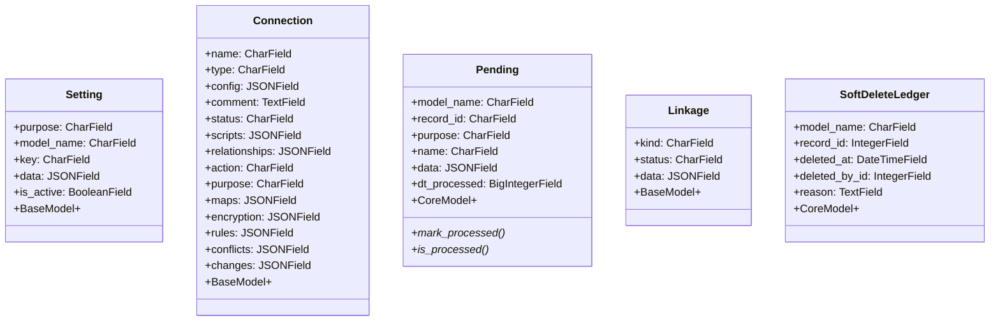

# WebClerk3 Data Models

## Model Inheritance Hierarchy



## Core Business Models

```mermaid
classDiagram
    class Contact {
        +name_first: CharField
        +name_last: CharField
        +email: CharField
        +company: CharField
        +phone: CharField
        +address: TextField
        +status: CharField
        +role: CharField
        +BaseModel+
    }

    class Action {
        +kind: CharField
        +status: CharField
        +priority: CharField
        +description: TextField
        +due_date: DateTimeField
        +assigned_to_id: IntegerField
        +BaseModel+
    }

    class Email {
        +contact_id: IntegerField
        +email: CharField
        +kind: CharField
        +status: CharField
        +verified_at: DateTimeField
        +BaseModel+
    }

    class Phone {
        +contact_id: IntegerField
        +phone: CharField
        +kind: CharField
        +status: CharField
        +verified_at: DateTimeField
        +BaseModel+
    }

    class Location {
        +contact_id: IntegerField
        +address: TextField
        +city: CharField
        +state: CharField
        +zip_code: CharField
        +country: CharField
        +kind: CharField
        +verified_at: DateTimeField
        +BaseModel+
    }

    class Document {
        +name: CharField
        +slug: SlugField
        +status: CharField
        +description: CharField
        +body: TextField
        +comment: TextField
        +data: JSONField
        +confidential: CharField
        +copyright: JSONField
        +count_accessed: IntegerField
        +model_name: CharField
        +retention_period: IntegerField
        +sequence: IntegerField
        +size_bytes: IntegerField
        +mime_type: CharField
        +path: JSONField
        +checksum: CharField
        +search_vector: SearchVectorField
        +BaseModel+
        +increment_access()*
        +rebuild_search_vector()*
    }

    Contact ||--o{ Action : performs
    Contact ||--o{ Email : has
    Contact ||--o{ Phone : has
    Contact ||--o{ Location : has
    Contact ||--o{ Document : owns
```

## Transaction Models



## Transaction Line Models

```mermaid
classDiagram
    class TransactionLineBaseModel {
        +parent_id: IntegerField
        +line_number: IntegerField
        +item_id: IntegerField
        +description: CharField
        +quantity: DecimalField
        +quantity_uom: CharField
        +price_unit: DecimalField
        +price_extended: DecimalField
        +cost_unit: DecimalField
        +cost_extended: DecimalField
        +discount_rate: DecimalField
        +discount_amount: DecimalField
        +tax_rate: DecimalField
        +tax_amount: DecimalField
        +status: CharField
        +due_date: DateTimeField
        +ship_date: DateTimeField
        +BaseModel+
    }

    class ProposalLine {
        +TransactionLineBaseModel+
        +probability: DecimalField
    }

    class SalesOrderLine {
        +TransactionLineBaseModel+
        +shipped_quantity: DecimalField
        +backorder_quantity: DecimalField
    }

    class PurchaseOrderLine {
        +TransactionLineBaseModel+
        +received_quantity: DecimalField
        +rejected_quantity: DecimalField
    }

    class InvoiceLine {
        +TransactionLineBaseModel+
        +paid_quantity: DecimalField
    }

    class WorkOrderLine {
        +TransactionLineBaseModel+
        +started_at: DateTimeField
        +completed_at: DateTimeField
        +assigned_to_id: IntegerField
    }

    class RequisitionLine {
        +TransactionLineBaseModel+
        +approved_quantity: DecimalField
    }

    TransactionLineBaseModel <|-- ProposalLine
    TransactionLineBaseModel <|-- SalesOrderLine
    TransactionLineBaseModel <|-- PurchaseOrderLine
    TransactionLineBaseModel <|-- InvoiceLine
    TransactionLineBaseModel <|-- WorkOrderLine
    TransactionLineBaseModel <|-- RequisitionLine

    TransactionBaseModel ||--o{ TransactionLineBaseModel : contains
```

## Product & Inventory Models

```mermaid
classDiagram
    class Catalog {
        +name: CharField
        +description: TextField
        +kind: CharField
        +status: CharField
        +price: JSONField
        +cost: JSONField
        +flags: JSONField
        +is_print_not: BooleanField
        +default_price: DecimalField
        +default_cost: DecimalField
        +BaseModel+
    }

    class InventoryLayer {
        +item_id: IntegerField
        +location_id: IntegerField
        +quantity: DecimalField
        +quantity_uom: CharField
        +cost_avg: DecimalField
        +cost_last: DecimalField
        +cost_standard: DecimalField
        +received_at: DateTimeField
        +expires_at: DateTimeField
        +lot_number: CharField
        +serial_numbers: JSONField
        +reservations: JSONField
        +CoreModel+
    }

    class InventoryReservation {
        +inventory_layer_id: IntegerField
        +contact_id: IntegerField
        +quantity: DecimalField
        +purpose: CharField
        +expires_at: DateTimeField
        +fulfilled_at: DateTimeField
        +CoreModel+
    }

    class BOMLine {
        +parent_id: IntegerField
        +component_id: IntegerField
        +revision: CharField
        +effective_from: DateField
        +effective_to: DateField
        +quantity: DecimalField
        +scrap_factor: DecimalField
        +yield_pct: DecimalField
        +sequence: IntegerField
        +is_alternate: BooleanField
        +alternate_group: CharField
        +is_optional: BooleanField
        +cost_snapshot: JSONField
        +op_data: JSONField
        +change_reason: CharField
        +dt_last_recalc: BigIntegerField
        +CoreModel+
    }

    class InventoryAdjustmentProcessorRun {
        +started_at: DateTimeField
        +completed_at: DateTimeField
        +records_processed: IntegerField
        +errors_encountered: IntegerField
        +CoreModel+
    }

    class InventoryMetricsSnapshot {
        +snapshot_date: DateField
        +total_value: DecimalField
        +total_quantity: DecimalField
        +metrics: JSONField
        +CoreModel+
    }

    Catalog ||--o{ InventoryLayer : tracked
    Catalog ||--o{ BOMLine : component_of
    InventoryLayer ||--o{ InventoryReservation : reserved_by
```

## Supporting Models



## JSON Field Structures

### Metadata Envelope
```json
{
  "security": "",
  "publish": "",
  "priority": "",
  "version": "1.0",
  "access": {
    "view": [],
    "edit": []
  },
  "resources": {
    "required": {},
    "allocated": {}
  },
  "flow": {},
  "source": {},
  "history": {
    "created": {"dt": 1730937600000, "contact_id": 0},
    "modified": {"dt": 1730937600000, "contact_id": 0},
    "accessed": {"dt": 1730937600000, "contact_id": 0},
    "verified": {"dt": 0, "contact_id": 0},
    "synced": {"dt": 0, "contact_id": 0}
  },
  "health": {
    "rating": 0,
    "completeness": 0,
    "accuracy": 0,
    "freshness": 0,
    "consistency": 0
  },
  "flags": {},
  "versioning": {},
  "undefined": {}
}
```

### Refs Envelope
```json
{
  "keywords": [],
  "tags": [],
  "links": {
    "contacts": [],
    "items": []
  },
  "depends_on": {},
  "categories": [],
  "related_ids": []
}
```

### Prefs Envelope
```json
{
  "userdefined": {},
  "submission": {
    "as_submitted": {
      "data": {},
      "dt": 1730937600000,
      "by": 123
    }
  }
}
```

### Comments Envelope
```json
{
  "general": {
    "public": [],
    "process": [],
    "partner": []
  },
  "records": {}
}
```

### Actions Envelope
```json
{
  "required": true,
  "status": "pending",
  "who": 123,
  "when": 1730937600000,
  "what": "call vendor",
  "kind": "followup",
  "extra": {}
}
```

## Database Indexes

- **GIN Indexes**: `refs`, `prefs`, `actions`, `search_vector`
- **Key Text Transforms**: `actions.status`, `actions.required`, `actions.who`, `actions.when`
- **Composite Indexes**: Various field combinations for query optimization
- **Partial Indexes**: Active records, status filters

## Model Capabilities Matrix

| Model | Inherits | Key Capabilities |
|-------|----------|------------------|
| Contact | BaseModel | Full envelope, keywords, lifecycle |
| Action | BaseModel | Full envelope, dependencies, status tracking |
| Email/Phone/Location | BaseModel | Verification flows, contact linking |
| Document | BaseModel | Search vectors, access tracking, linkage |
| Transaction Headers | BaseModel | Totals aggregation, flow tracking |
| Transaction Lines | BaseModel | Lineage, serial tracking, parent linking |
| Catalog | BaseModel | Pricing/costing structures, flags |
| InventoryLayer | CoreModel | Lightweight tracking, reservations |
| Connection | BaseModel | External integrations, encryption |
| Setting | BaseModel | Configuration management |
| Pending | CoreModel | Queue processing, minimal overhead |
| Linkage | BaseModel | Cross-entity relationships |

This data model documentation provides a comprehensive view of WebClerk3's domain structure, inheritance patterns, and JSON envelope usage.