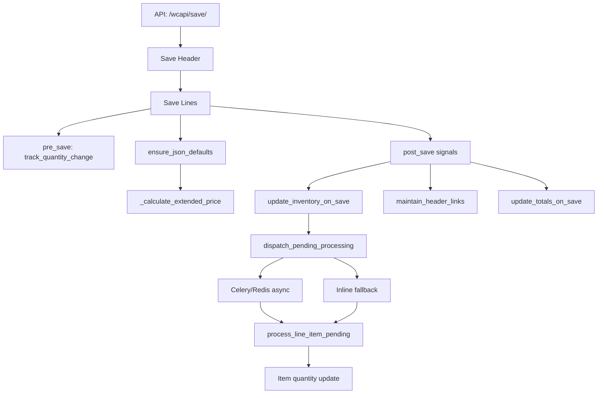

# Transactions: Line Calculations, Quantity Flow & Totals Rollup

> **Last updated**: 2026-02-17

---

## Code Path Index

Quick reference to the source files discussed in this document:

| Concern | File | Key symbols |
|---------|------|-------------|
| JSON defaults & extended calc | `apps/transactions/models/base_line_model.py` | `default_quantity()` :60, `BaseLineCore` :283, `ensure_json_defaults()` :327, `BaseSellLineModel` :363, `_calculate_extended_price()` :388, `BaseExecLineModel` :431 |
| Totals rollup (sell-side) | `apps/transactions/services/proposal_totals.py` | `compute_proposal_sell_cost_totals()` :12 |
| | `apps/transactions/services/order_totals.py` | `compute_order_sell_cost_totals()` :12 |
| | `apps/transactions/services/invoice_totals.py` | `compute_invoice_sell_cost_totals()` :12 |
| Totals rollup (exec-side) | `apps/transactions/services/purchase_totals.py` | `compute_purchase_sell_cost_totals()` :12 |
| | `apps/transactions/services/po_totals.py` | `compute_purchase_cost_totals()` :8 |
| Transfer: quantity conversion | `apps/transactions/services/transfer_utils.py` | `convert_quantity_from_source()` :21, `build_line_payload()` :114 |
| Transfer: proposal → order | `apps/transactions/services/proposal_to_order.py` | `_convert_quantity_from_proposal()` :92, `transfer_proposal_to_order()` :141 |
| Transfer: order → invoice | `apps/transactions/services/order_to_invoice.py` | `transfer_order_to_invoice()` :13, `_convert_quantity_for_invoice()` :176, `_update_order_line_quantity()` :199 |
| Signals (auto-recalc) | `apps/transactions/signals.py` | `register_line_totals_signals()` :183, `_LINE_CONFIG` :218, ProposalLine-only registration :233 |

---

## 1. Line-Level Calculations

### How `extended` is computed on save

Every line's `save()` calls `ensure_json_defaults()` (`base_line_model.py:327`),
which seeds missing JSON fields and — for sell-side lines — computes extended values.

#### Sell-side lines (BaseSellLineModel → ProposalLine, OrderLine, InvoiceLine)

`_calculate_extended_price()` at `base_line_model.py:388`:

```
price.extended = (quantity.placed × price.unit) − discount_amount
cost.extended  = (quantity.placed × cost.unit)  − discount_amount
```

Where discount_amount is:

- Used directly if explicitly provided and non-zero
- Otherwise computed: `gross × (discount_percent / 100)`

In code (`_calculate_extended_price` at `base_line_model.py:388`):

```python
quantity = self.quantity.get("placed", 0)
gross    = quantity × unit_price                    # Decimal-precise
discount = gross × (discount_percent / 100)         # if no explicit amount
extended = gross − discount_amount
```

Both `price` and `cost` envelopes follow the same formula. Precision is
controlled by `price.precision` / `cost.precision` (default: 2).

#### Exec-side lines (BaseExecLineModel → PurchaseLine, WorkOrderLine, ReceiptLine)

`BaseExecLineModel` at `base_line_model.py:431` — exec-side lines do **not**
auto-compute `cost.extended` on save.
Extended cost must be set explicitly by the caller or via `LineItemService._recalculate_line()`.

### `ensure_json_defaults()` seeding workflow

`BaseLineCore.ensure_json_defaults()` at `base_line_model.py:327`;
`BaseSellLineModel.ensure_json_defaults()` override at `base_line_model.py:382`:

```
Line.save()
 └─ ensure_json_defaults()
      ├─ Seed missing envelopes from factories:
      │    item      → default_item()        # item_id, ida_item, description, sequence…
      │    cost      → default_cost()        # unit, extended, shipping, handling, freight…
      │    tax       → default_tax()         # sales_rate, cost_rate…
      │    physical  → default_physical()    # weight, dimensions, volume…
      │    quantity  → default_quantity(kind) # placed, actioned, remaining  (base_line_model.py:60)
      │    price     → default_price()       # [sell-side only] unit, extended, discount…
      │
      ├─ normalize_cost_map()  — always (fixes nulls, ensures all keys exist)
      ├─ normalize_price_map() — sell-side only
      └─ _calculate_extended_price() — sell-side only (base_line_model.py:388)
```

---

## 2. Quantity Flow Between Transactions

When a transfer service converts one transaction to another, quantity flows
from the **source line's `remaining`** into the **target line**, and the source
line's `actioned` is incremented.

### End-of-chain semantics (invoices)

Invoice lines sit at the end of the transfer chain — nothing downstream acts
on them.  They use **actioned-first** quantity rules:

| Rule | Detail |
|------|--------|
| User edits `actioned` | The qty the user types IS the invoiced amount |
| Standalone (no parent) | `placed = actioned` |
| Transferred | `placed = source.remaining`, `actioned = placed` |
| `remaining` | Always **0** — nothing downstream from an invoice |

All other transaction types (orders, proposals, purchases) use **placed-first**
semantics: the user edits `placed`, `actioned` starts at 0, and
`remaining = placed − actioned`.

Key code paths:
- Generic converter: `transfer_utils.py:21` — `convert_quantity_from_source()`
- Proposal → Order: `proposal_to_order.py:92` — `_convert_quantity_from_proposal()`
- Order → Invoice: `order_to_invoice.py:176` — `_convert_quantity_for_invoice()`
- Source line update: `order_to_invoice.py:199` — `_update_order_line_quantity()`

### The pattern

```
Source Line (e.g. OrderLine)          Target Line (e.g. InvoiceLine)
┌──────────────────────────┐          ┌──────────────────────────┐
│ placed:    10             │ ──────▶ │ placed:    10             │
│ actioned:   0 → 10       │          │ actioned:  10             │
│ remaining: 10 →  0       │          │ remaining:  0             │
└──────────────────────────┘          └──────────────────────────┘
```

**Rules:**
1. Target `placed` = source `remaining` (the qty being transferred)
2. Source `actioned` += transferred amount
3. Source `remaining` = source `placed` − source `actioned`
4. Target `actioned` = target `placed` for invoices (end-of-chain);
   starts at 0 for orders/proposals
5. Target `remaining` = 0 for invoices; = target `placed` for orders/proposals

### Full chain example: Proposal → Order → Invoice

```
ProposalLine          OrderLine              InvoiceLine
placed:    10         placed:    10          placed:    10
actioned:   0→10      actioned:   0→10       actioned:  10
remaining: 10→ 0      remaining: 10→ 0       remaining:  0
status: transferred   status: transferred    status: planned
```

### Partial transfer example: Order (10) → Invoice (6), backlog (4)

```
OrderLine                InvoiceLine #1
placed:    10            placed:     6
actioned:   0→ 6         actioned:   6
remaining: 10→ 4         remaining:  0

                         (later) InvoiceLine #2
OrderLine (updated)      placed:     4
actioned:   6→10         actioned:   4
remaining:  4→ 0         remaining:  0
```

### Transfer service implementation

Each transfer service follows this pattern:

```python
# 1. Read source quantity
src_qty = source_line.quantity
transfer_amount = src_qty.get("remaining", 0)  # what's left to transfer

# 2. Build target quantity
# For invoices (end-of-chain): actioned = placed, remaining = 0
# For orders/proposals: actioned = 0, remaining = placed
is_end_of_chain = target_type == "invoice"
target_qty = {
    "placed": transfer_amount,
    "actioned": transfer_amount if is_end_of_chain else 0,
    "remaining": 0 if is_end_of_chain else transfer_amount,
    "is_fixed": src_qty.get("is_fixed", False),
    "precision": src_qty.get("precision", 2),
}

# 3. Create target line (copies price/cost/item from source)
target_line = TargetLineModel.objects.create(
    parent_fk=target_header,
    quantity=target_qty,
    price=source_line.price,              # extended already computed
    cost=source_line.cost,
    item=source_line.item,
    refs={"source": {"model": "order_line", "id": source_line.pk}},
)

# 4. Update source line
src_qty["actioned"] = src_qty.get("actioned", 0) + base
src_qty["remaining"] = max(0, src_qty["placed"] - src_qty["actioned"])
source_line.quantity = src_qty
source_line.status = "transferred"
source_line.save()
```

### Lineage tracking via `refs`

Target lines record their provenance:

```json
{
  "refs": {
    "source": { "model": "order_line", "id": 144 },
    "xfer": {
      "version": 1,
      "transferred_at": "2026-02-17T14:30:00Z",
      "from_header": { "model": "order", "id": 61 }
    }
  }
}
```

This enables rollup queries: *"how much of order line #144 has been invoiced?"*
→ query `InvoiceLine` where `refs.source.id = 144`, sum `quantity.placed`.

---

## 3. Lines Accumulate to Transaction Totals

### Scope

| Side | Headers | Line base | Aggregates |
|------|---------|-----------|------------|
| Sell-side | Proposal, Order, Invoice | `BaseSellLineModel` | `sell` + `cost` + `totals` |
| Exec-side | Purchase, WorkOrder | `BaseExecLineModel` | `cost` + `totals` (no `sell`) |

### Rollup formula (sell-side)

For each line in `header.lines.all()`:

```
sell.line_sum_goods   += line.price.extended
sell.discount         += line.price.discount_amount
cost.line_sum_goods   += line.cost.extended
cost.line_sum_tax     += line.cost.tax
cost.line_sum_shipping += line.cost.shipping
cost.line_sum_handling += line.cost.handling
cost.freight          += line.cost.freight
cost.commissions      += line.cost.commissions
```

Then:

```
sell.total  = sell.line_sum_goods
cost.total  = cost.line_sum_goods + cost.line_sum_tax + cost.line_sum_shipping
              + cost.line_sum_handling + cost.freight + cost.commissions

totals.total     = sell.total
totals.cost      = cost.total
totals.margin    = sell.total − cost.total
totals.margin_pc = (margin / sell.total) × 100    # if sell.total > 0
totals.received  = (from payments)
totals.balance   = totals.total − totals.received
```

### Rollup formula (exec-side)

Same `cost` aggregation. No `sell` or `price`. `totals.total = cost.total`.

### Output shapes

```json
{
  "sell": {
    "line_sum_goods": 1000.00,
    "discount": 50.00,
    "tax": 0,
    "shipping": 0,
    "handling": 0,
    "other": 0,
    "total": 1000.00
  },
  "cost": {
    "line_sum_goods": 600.00,
    "line_sum_tax": 0,
    "line_sum_shipping": 25.00,
    "line_sum_handling": 10.00,
    "freight": 15.00,
    "commissions": 30.00,
    "tax_rate": 0,
    "tax": 0,
    "total": 680.00
  },
  "totals": {
    "total": 1000.00,
    "cost": 680.00,
    "margin": 320.00,
    "margin_pc": 32.0,
    "received": 0,
    "balance": 1000.00
  }
}
```

### How rollup is triggered

Each header model exposes `update_sell_cost_totals()` which delegates to the
matching `compute_*_sell_cost_totals()` function:

| Header | Service | Line |
|--------|---------|------|
| Proposal | `proposal_totals.py:12` | `compute_proposal_sell_cost_totals()` |
| Order | `order_totals.py:12` | `compute_order_sell_cost_totals()` |
| Invoice | `invoice_totals.py:12` | `compute_invoice_sell_cost_totals()` |
| Purchase | `purchase_totals.py:12` | `compute_purchase_sell_cost_totals()` |
| Purchase (cost-only) | `po_totals.py:8` | `compute_purchase_cost_totals()` |

```python
def update_sell_cost_totals(self, persist=False):
    computed = compute_*_sell_cost_totals(self)
    if persist:
        self.sell = computed["sell"]
        self.cost = computed["cost"]
        self.totals = computed["totals"]
        self.save(update_fields=["sell", "cost", "totals", "dt_modified", "version"])
```

### Signal-based auto-recalc

Registration at `signals.py:218` (`_LINE_CONFIG`) and `signals.py:233`
(ProposalLine-only totals).  Factory at `signals.py:183`
(`register_line_totals_signals`).

| Line Model | Auto-recalc on save? | Status |
|------------|---------------------|--------|
| ProposalLine | Yes (post_save signal) | Working |
| OrderLine | No | **Needs signal** |
| InvoiceLine | No | **Needs signal** |
| PurchaseLine | No | **Needs signal** |
| WorkOrderLine | No | **Needs signal** |

Until signals are wired for all line types, the save view or service layer
must call `header.update_sell_cost_totals(persist=True)` explicitly after
modifying lines.

---

## 4. Complete Data Flow: Save → Calc → Signals → Inventory

eventual Item record update.  File references use `module:line` notation
matching the Code Path Index above.
This section traces a line save from API entry through every signal to the eventual Item record update. File references use `module:line` notation matching the Code Path Index above.

### Data Flow Diagram

Below is a visual summary of the end-to-end flow from API save to inventory update:



---

### Error Handling & Fallbacks

- **Signal failures:** If a signal handler fails, Django logs the error and continues processing other signals. Critical inventory and totals signals should be monitored for exceptions.
- **Celery worker offline:** If no Celery worker is alive, inventory processing falls back to synchronous inline execution. See [celery-redis-pending.md](../../celery-redis-pending.md) for details.
- **Pending record issues:** If Pending records cannot be created or processed, inventory deltas may be lost. Safety net: Celery Beat retries every 30s.
- **Database errors:** All saves are wrapped in atomic transactions; partial failures roll back changes.
- **Validation:** Lines and headers are validated before save; invalid payloads return 400 errors.

---

### Glossary

- **Pending record:** Temporary record tracking inventory delta until processed.
- **Celery:** Background task queue for async processing.
- **Redis:** Broker/cache for Celery tasks and worker liveness.
- **Signal:** Django mechanism for event-driven callbacks (pre_save, post_save, post_delete).
- **Lineage:** Provenance tracking via `refs` field on lines.
- **Header:** Parent transaction (Order, Invoice, etc.) containing lines.
- **Line:** Child record representing an item, quantity, price, etc.

---

### Concrete Example: OrderLine Save & Inventory Posting

Suppose an OrderLine is saved with `quantity.placed = 5` for item #42:

1. API `/wcapi/save/` receives payload.
2. Order header and OrderLine are saved.
3. `track_quantity_change` pre_save signal snapshots original quantity.
4. `ensure_json_defaults` seeds missing fields; `_calculate_extended_price` computes price.
5. `update_inventory_on_save` post_save signal compares new vs original quantity, creates Pending record for item #42, delta = +5.
6. `dispatch_pending_processing` checks Celery worker:
   - If alive: Pending processed async.
   - If offline: Pending processed inline.
7. `process_line_item_pending` updates Item #42's quantity buckets.
8. Response returns updated header and lines.

---

### Cross-links & Related Documents

- [../../celery-redis-pending.md](../../celery-redis-pending.md) — Celery & Redis background task processing
- [../infrastructure/celery.md](../infrastructure/celery.md) — Celery + Redis installation & Django configuration
- [../inventory/inventory.md](../inventory/inventory.md) — Inventory layering, PendingInventoryAdjustment, Item bucket schema
- [transaction_line_save.md](transaction_line_save.md) — Save endpoint architecture
- [transaction_flows.md](transaction_flows.md) — Lineage, parent_model/parent_id
- [transaction_flow_test_plan.md](transaction_flow_test_plan.md) — Test plan for all of the above

### Signal registration summary

All 5 line types register inventory + header-links signals.
Only ProposalLine registers the totals signal.  See `signals.py:218`
(`_LINE_CONFIG`) for the full registration table.

| Signal | Phase | All 5 types? | Purpose |
|--------|-------|-------------|---------|
| `track_quantity_change` | `pre_save` | Yes | Snapshot original qty for delta calc |
| `update_inventory_on_save` | `post_save` | Yes | Create `Pending` record for inventory |
| `maintain_header_links` | `post_save` | Yes | Append line ID to `header.refs.links` |
| `update_totals_on_save` | `post_save` | ProposalLine only | Auto-recalc parent totals |
| `update_inventory_on_delete` | `post_delete` | Yes | Reverse `Pending` on line delete |

### Related: Celery / Redis / Pending

For the full Celery + Redis architecture, broker configuration, Beat schedule,
worker liveness detection, and inline fallback, see:

- [../../celery-redis-pending.md](../../celery-redis-pending.md) — Celery & Redis background task processing
- [../infrastructure/celery.md](../infrastructure/celery.md) — Celery + Redis installation & Django configuration
- [../inventory/inventory.md](../inventory/inventory.md) — Inventory layering, PendingInventoryAdjustment, Item bucket schema

---

## 5. Comparison with 4D Legacy

| Concept | 4D (acceptInvoice) | WC3 |
|---------|-------------------|-----|
| Line extended calc | `InvoiceLinesCalc` / `calcInvoice(True)` | `_calculate_extended_price()` at `base_line_model.py:388` |
| Header rollup | Manual loop: `For ($inc; 1; $cnt)` summing fields | `compute_*_sell_cost_totals()` at `*_totals.py:12` |
| Parent order recalc | `Accept_CalcStat` + manual field-by-field sum | Transfer service + `update_sell_cost_totals()` |
| Quantity tracking | `qtyShipped`, `qtyBackLogged` (per-type fields) | `quantity.placed/actioned/remaining` via `default_quantity()` at `base_line_model.py:60` |
| Quantity transfer | Direct assignment | `convert_quantity_from_source()` at `transfer_utils.py:21` |
| Inventory | `INVT_dInvtApply`, `TallyInventory` | `PendingInventory` via post_save signal at `signals.py:218` |
| Ledger | `Ledger_InvSave` | `apps/accounts/models/ledger.py` — terms → ledger rows |
| Customer balance | Direct field update: `salesYTD += delta` | Via `totals.received`, `totals.balance` on Invoice |

---

## Related Documents

- [00_instructions.md](00_instructions.md) — Master architecture, model hierarchy, JSON shapes
- [transaction_line_save.md](transaction_line_save.md) — Save endpoint architecture
- [transaction_flows.md](transaction_flows.md) — Lineage, parent_model/parent_id
- [transaction_flow_test_plan.md](transaction_flow_test_plan.md) — Test plan for all of the above
