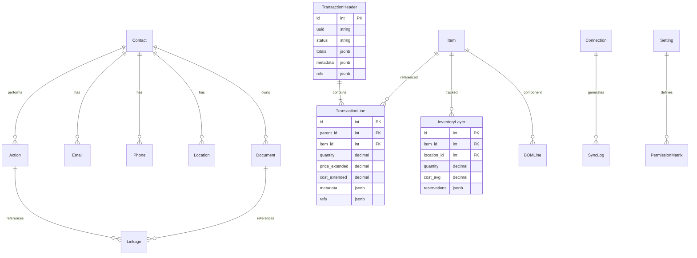
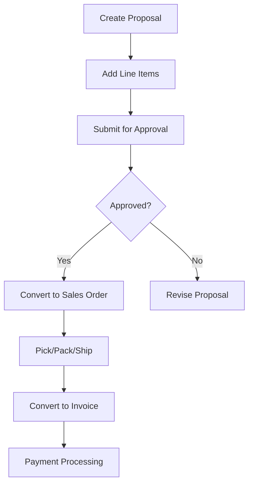
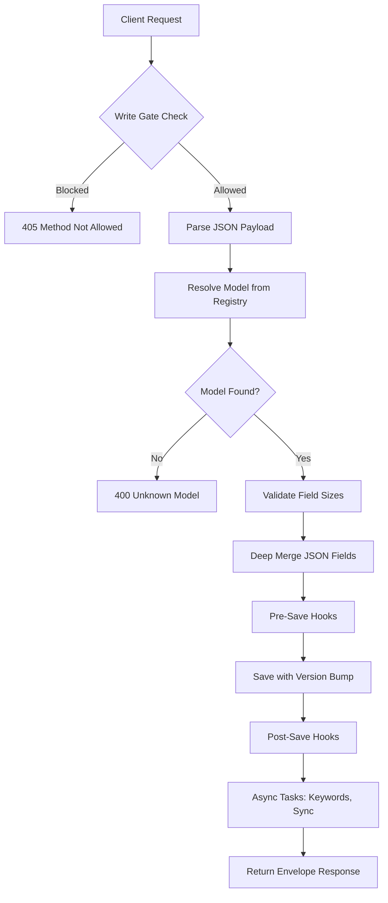
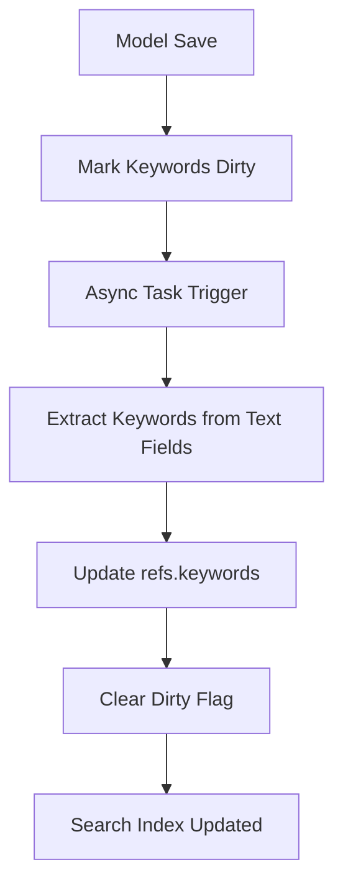

# WebClerk3 Architecture Overview

## Overview

WebClerk3 is a Django-based backend application designed for managing commerce and business operations. It provides a universal API for CRUD operations across various business entities, emphasizing modularity, extensibility, and clean transaction flows. The system supports contact management, communications, transactions (proposals, orders, invoices), products/inventory, synchronization with external services, and documentation management.

## Key Principles

- **Universal API**: One API pattern handles all data operations using a consistent envelope structure
- **Contact-Centric**: Everything revolves around contact entities
- **Modular Architecture**: Composable model mixins allow flexible capability composition
- **Optimistic Concurrency**: Version-based conflict resolution for concurrent updates
- **JSON-First Design**: Extensive use of JSON fields for extensibility without schema churn
- **Soft Lifecycle Management**: Reversible deletes and archiving
- **Field-Level Permissions**: Granular access control via settings-driven matrices

## Architecture Layers

### 1. Core Infrastructure

#### Base Model System
WebClerk3 uses a composable model system built on Django's ORM:

```
CoreModel (minimal identity + timestamps + version)
├── MetadataMixin (historized metadata, flags, versioning)
├── RefsMixin (keywords, tags, lightweight links)
├── PrefsMixin (user preferences, settings)
├── CommentsMixin (threaded notes, audit trails)
├── ActionsMixin (next-step metadata, status tracking)
├── HealthMixin (data quality scores)
├── KeywordsMixin (async keyword extraction)
├── LifecycleMixin (soft delete/archive)
├── UniversalDictMixin (stable serialization)
└── AtomicJSONMixin (partial JSON updates)
    └── BaseModel (full composition)
```

#### Universal API System
- **Endpoints**: `/wcapi/save/`, `/wcapi/manage/`, `/wcapi/get/`, `/wcapi/query/`
- **Registry**: Explicit model allow-list in `apps/core/services/wcapi_registry.py`
- **Envelope**: Consistent JSON response structure with `status`, `data`, `error`, `meta`
- **Write Gate**: Middleware blocks ad-hoc writes, routing through centralized save endpoint
- **Rate Limiting**: 1000/day authenticated, 100/day anonymous

### 2. Business Domains

#### Core Entities
- **Contact**: Central entity with relationships to all other data
- **Action**: Activity records with status and dependencies
- **Communication**: Email, phone, location with verification flows
- **Document**: File metadata with search vectors and linkage

#### Transaction System
- **Headers**: Proposal, SalesOrder, PurchaseOrder, Invoice, WorkOrder, Requisition
- **Lines**: Corresponding line items with quantity, pricing, costing
- **Flows**: Proposal → Sales Order → Invoice; Purchase Order → Invoice
- **Lineage**: Serial tracking and parent-child relationships
- **Aggregation**: Cached totals with automatic invalidation

#### Product & Inventory
- **Catalog**: Product definitions with pricing/costing structures
- **Inventory**: Layer-based stock tracking with reservations
- **BOM**: Bill of Materials for assemblies
- **Reservations**: Soft holds with expiration

#### Synchronization
- **Connections**: External service integrations (Google Calendar, alerts)
- **Verification**: Email, phone, domain verification flows
- **Exchange**: Data transformation and conflict resolution

### 3. Technical Components

#### Data Persistence
- **PostgreSQL**: Primary database with JSONB, full-text search, GIN indexes
- **Migrations**: Squashed and managed via Django migrations
- **Caching**: Redis for session storage and Celery broker

#### Asynchronous Processing
- **Celery**: Background tasks for keyword refresh, email sending, sync operations
- **Queues**: Dedicated queues for different operation types
- **Monitoring**: Flower dashboard for task monitoring

#### Security & Permissions
- **Authentication**: JWT or session-based
- **Authorization**: Field-level permissions via settings matrices
- **Audit**: Request logging, change tracking in metadata
- **Encryption**: Configurable for sensitive connection data

#### API Features
- **Pagination**: Universal with `limit`/`offset` parameters
- **Projection**: Selective field retrieval with `fields` parameter
- **Filtering**: Safe filter allow-list with strict mode option
- **Sorting**: Configurable ordering with `-` prefix for descending
- **Search**: Keyword-based with async refresh pipeline

## Data Model Relationships



## Key Workflows

### 1. Transaction Flow


### 2. Universal Save Flow


### 3. Keyword Refresh Pipeline


## Configuration & Settings

- **Environment Variables**: Database, Redis, email, security keys
- **Django Settings**: API limits, feature flags, middleware configuration
- **Settings Model**: Runtime configuration for permissions, features, mappings
- **Feature Flags**: Granular control over capabilities per model

## Deployment Considerations

- **WSGI/ASGI**: Gunicorn/Uvicorn for serving
- **Reverse Proxy**: Nginx for static files and SSL termination
- **Monitoring**: Prometheus metrics, structured logging
- **Backup**: Database dumps, file storage backups
- **Scaling**: Read replicas, connection pooling, cache layers

## Development Workflow

- **Virtual Environment**: Isolated Python environment
- **Pre-commit Hooks**: Code quality and consistency checks
- **Testing**: Pytest with SQLite for fast tests, Postgres for integration
- **Migrations**: Safe schema evolution with rollback planning
- **Documentation**: Extensive README ecosystem in `readmes/` directory

## Areas for Potential Improvement

1. **API Documentation**: Enhanced OpenAPI specs with better examples
2. **Performance**: Query optimization for large datasets, pagination tokens
3. **Testing**: More comprehensive integration tests, especially for transaction flows
4. **Monitoring**: Better observability with distributed tracing
5. **Security**: Enhanced audit logging and compliance features
6. **Scalability**: Microservice decomposition for high-volume operations

This overview provides a foundation for understanding WebClerk3's architecture. The system is designed for flexibility and maintainability while supporting complex business workflows.